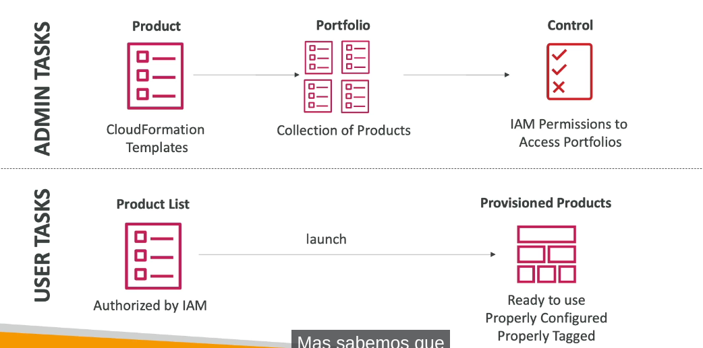
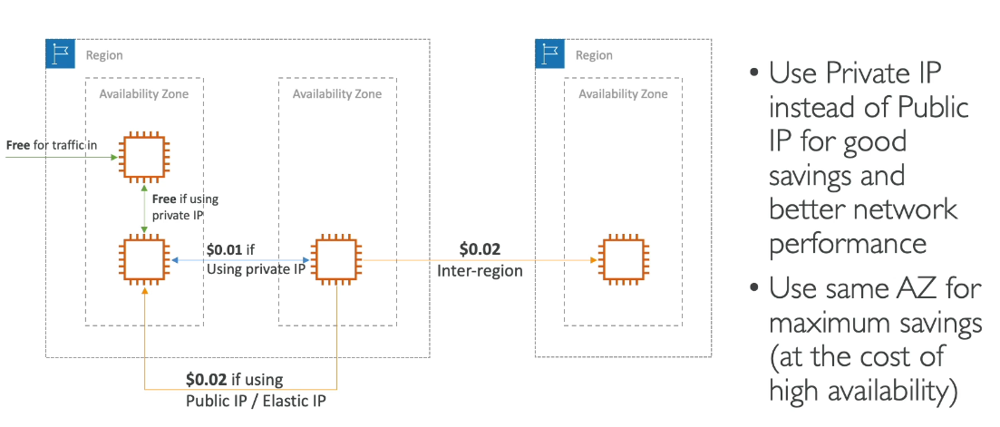

# AWS Organizations

- Global Service
- Allows to manage multiple AWS accounts
- main account is the master account
- Cost benefits:
  - **Consolidated Billing** acroos all accounts - single payment method
  - Pricing benefits from **aggregated usage** (volume discount for EC2, S3)
  - Pooling of reverved EC2 Instances for optimal saving
- API is available to **automate AWS account creation**
- **Restrict account priviledges using Service Control Policies (SCP)**

## Multi Account Strategies

- Create accounts per department, per cost center, per dev / test / prod, based on regulatory restrictions (using SCP), for better resource isolation (ex: VPC), to have separate per-account service limits, isolated account for logging

- Multi account vs One Account multi VPC
- Use Tagging standards for billing purposes

### Organizational units (OU)

- E.g: Sales OU / Finance OU / Retail OU
- Each OU has multiple accounts
- Can be Project Based, ou by Environment or others

## Service Control Policies (SCP)

- whitelist or blacklist IAM actions
- Applied to the OU or Account level
- Does not apply to the Master Account
- SCP is applied to all the Users and Roles of the account, including Root
- The SCP does not affect service-linked roles
- SCP must have an explicit Allow (does not allow anything by default)
- Use cases: Restrict access to certain services (for example: can't use EMR)

## Consolidated Billing

- When enabled, provides with:
  - Combined usage: combine the usage across all AWS accounts in the AWS organization to share the volume pricing, Reserved Instances and Saving Plans
  - One Bill - get one bill for all AWS accounts in the AWS Organization
- The management account can turn off Reserved Instances discount sharing for any account in the AWS Organization, including itself

# AWS Control Tower

- Easy way to set up and govern a secure and compliant **multi-account AWS environment** based on best practices
- Benefits:
  - automate the set up of your environment in a few clicks
  - automate ongoing policy management using guardrails
  - detect policy violations and remediate them
- AWS Control Tower runs on top of Organization
  - it automatically sets up AWS Organizations to organize accounts and implement SCPs (Service Control Policies)

# AWS RAM - Resource Access Manager

- share AWS resources that you own with other AWS accounts
- share with any account of within your Organization
- avoid resource duplication
- supported: Aurora, VPC Subnets, Transit Gateway, Route 53, EC2 Dedicated hosts, License Manager Configuration

# AWS Service Catalog

- too many options, and may create stacks that are not compliant / in line with the rest of organization
- Some users just want a quick self-service portal to launch a set of authorized products pre-defined by admins
- includes: virtual machines, databases, storage options
- Admin:

  - create products which are Cloudformation Templates
  - Portfolio - Collection of products
  - Control: IAM Permissions to Access Portfolios

- User:
  - Product list - authorized by IAM
  - launch -> ready to use project configured and properly tagged

# Pricing Models in AWS

- AWS has 4 pricing models:

  - **Pay as you go**: pay fo what you use, agile, responsive, meet scale demands
  - **Save when you reserve**: minimize risks, predictably manage budgets, comply with long-term requirements
    - reservation are available for EC2 Reserved instances, DynamoDB Reserved Capacity, ElastiCache Reserved Nodes, RDS reserved instance, Redshift Reserved nodes
  - **Pay less by using more**: volume-based discounts
  - **Pay less as AWS grows**

- Free Services & Free tier in AWS
  - IAM
  - VPC
  - Consolidated Billing
  - Elastic Beanstalk
  - CloudFormation
  - Auto Scaling Groups
    (you pay for resources created)
  - Free tier: EC2, S3, EBS, ELB, AWS Data transfer

## Compute Pricing - EC2

- only charged for what you use
- number of instances
- instance configuration
  - Physical capacity
  - Region
  - OS and software
  - Instance type
  - Instance size
- ELB running time and amount of data processed
- Detailed monitoring

- **On-demand instances**
  - minimum of 60s
  - pay per second (Linux/Windows) or per hour
- **Reserved Instances**
  - up to 75% discount compared to on-demand on hourly rate
  - 1 or 3 years commitment
- **Spot Instances**
  - up to 90% discount compared to on-demand on hourly rate
  - bid for unused capacity
- **Dedicated host:**
  - on demand
  - Reservation for 1 or 3 years commitment
- **Saving plans** as an alterative to save on sustained usage

## Compute Pricing - Lambda and ECS

- Lambda

  - pay per call
  - pay per duration

- ECS

  - EC2 Launch type model: no addictional fees, you pay for AWS Resources stored and created in your application

- Fargate
  - Fargate Launch type Model: pay for vCPU and memory resources allocated to your applications in your containers

## Compute Pricing - S3

- Storage class
- number and size of objects - price can be tiered - based on volume
- number and type of requests
- data transfer out of the S3 region
- S3 transfer acceleration
- Lifecycle transitions

- Similar service: EFS - pay per use, has infrequent access and lifecycle rules

## EBS

- volume type (based on performance)
- storage volume in GB per month provisioned
- IOPS
  - general purpose SSD: included
  - provisioned IOPS SSD: provisioned amount in IOPS
  - magnetic: number of requests
- Snapshots
  - added data cost per GB per month
- Data transfer
  - outbound data transfer are tiered for volume discounts
  - inbound is free

## RDS

- per hour billing
- database characteristics
  - engine
  - size
  - memory class
- purchase type
  - on demand
  - reserved instances (1 or 3 years) with required up front
- backup storage: there is no additional charge for backup storate up to 100% of your total database storage for a region
- additional storage (per GB per month)
- number of input and output requests per month
- deployment type (storage and I/O are variable)
  - single AZ
  - multiple AZ
- data transfer
  - outbound data transfer are tiered for volume discount
  - inbound is free

## CloudFront

- pricing is different across different geographic regions
- aggregated for each edge location, then applied to your bill
- data transfer out (volume discount)
- number of http/https requests

## Networking costs in AWS per GB - Simplified

- free for traffic in
- free for inner traffic if using private IP
- use Private IP for good saving and better network performance
- use sam AZ for maximum savings (at the cost of high availability)

# Savings Plan

- Commit a certain $ amount per hour for 1 or 3 years
- Easiest way to set up long-term commitments on AWS
- EC2 savings plan
  - up to 72% discount compared to on-demand
  - commit ot usage of individual instance families in a region
  - regardless of AZ, size, OS or tenancy
  - all upfront, partial upfront, no upfront
- Compute Savings plan
  - up to 66% discount compared to on-demand
  - regardless of Family, region, size, os, tenancy, compute options
  - compute options: EC2, Fargate, lambda
- Machine learning savings plan: Sagemaker
- setup from the AWS cost Explorer console

# Compute optimizer

- Reduce costs and improve performance by recommending optimal AWS resources for your workloads
- helps you choose optimal configurations and right-size for your workloads (over / under provisioned)
- uses machine learning to analyze your resources configurations and their utilization CloudWatch metrics

- Supported Resources

  - EC2 instances
  - EC2 auto scaling groups
  - EBS volumes
  - Lambda functions

- Lower your costs by up to 25%
- recommendations can be exported to S3

# Billing and Costs Tools Overview

- estimaging cots in the cloud:
  - pricing calculator
- tracking costs in the cloud:
  - Billing Dashboard
  - Cost Allocation Tags
  - Cost and usage reports
  - Cost Explorer
- Monitoring against costs plans:
  - billing alarms
  - Budgets

# AWS Pricing Calculator

- Estimate the cost for your solution architecture
- select the service
- select region
- input information

# Tracking Costs in the Cloud

## Billing Dashboards

- Billing and costs management
- Free tier dashboard is included in the Billing Dashboard

### Cost Allocations Tags

- use cost allocation tags to track your AWS costs on a detailed level
- **AWS generated Tags**
  - automatically generated to the resource you create
  - starts with Prefix aws
- **User defined tags**
  - defined by the user
  - starts with prefix user
- Tags are used for organizing resources
  - resources created by CloudFormation are all tagged the same way
- Tags can be used to create Resource Groups
  - create, maintain, and view a collection of resources that share common tags
- Create resource Group - TAG based

### Cost and Usage Reports

- dive deeper into your AWS costs and usage
- contains the most comprehensive set of AWS cost and usage data available
- includes aditional metadata
- list AWS usage for each service category used by an account and its IAM users in hourly or daily line items, as well as any tags that you have activated for cost allocation purposes
- can be integrated with Athena, Redshift or Quicksight

### Cost Explorer

- visualize, understand and manage your AWS costs and usage over time
- create custom reports that analyze cost and usage data
- analyze your data at a high level: total costs and usage across all accounts
- or monthly, hourly, resource level granularity
- choose an optimal **Savings Plan**
- Forecast usage up to 12 months based on previous usage

## Billing Alarms

- Billing data metric is store in CloudWatch us-east-1
- Billing data are for overall worldwide costs
- actual costs, not projected costs
- intended a simple alarm (not as powerful as AWS Budgets)

## AWS Budgets

- Create Budgets and **send alarms when costs exceeds the budget**
- 4 types of budgets: Usage, Cost, Reservation, Saving Plans
- For Reserved Instances (RI)
  - track utilization
  - Supports EC2, ElastiCache, RDS, Redshift
- Up to 5 SNS notifications per budget
- can filter by: service, linked account, Tag, Purchase Option, Instance Type, Region, Availability Zone, API Operation
- Same Options as AWS Cost Explorer
- 2 budgets are free then 0.02/day/budget

## AWS Cost Anomaly Detection

- **Continuously monitor your cost and usage ML to detect unusual spends**
- it learns your unique, historic spend patterns to detect one-time cost spike and or continuos cost increases (you don't need to define thresholds)
- Monitor AWS services, member accounts, cost allocation tags, or cost categories
- Sends you the anomaly detection report with root-case analysis
- Get notified with individual alerts or daily/weekly summary (using SNS)

## AWS Service Quotas

- notify you when you are close to a service quota value threshold
- create CloudWatch Alarms on the Service Quotas console
- Example: Lambda Concurrent Executions
- Request a quota increase from AWS Service Quotas or shutdown resources before limit is reached

## AWS Trusted Advisor

- no need to install
- high level AWS account assessment
- Analyze your AWS accounts and provides recommendations on 6 categories:
  - Cost optimization
  - Performance
  - Security
  - fault tolerance
  - Service limits
  - Operational Excellence
- Business & Enterprice Support plan
  - full set of checks
  - programmatic access using AWS Support API

## AWS Support Plans

### AWS Basic Support Plan

- Customer Service and Communities -24x7 access to customer service, documentation, whitepapers and support forums
- AWS Trusted Advisor - Access to the 7 core Trusted Advisor checks and guidance to provision your resources following best practices to increase performance and improve security
- AWS Personal Health Dashboard - personalized view of the health of AWS Services, and alerts when your resources are impacted

### AWS Developer Support Plan

- All Basic Support Plan
- Business hours email access to Cloud Support Associates
- unlimited cases / unlimited contacts
- Case severity / response times:
  - general guidance: < 24 business hours
  - System impaired: < 12 business hours

### Business Support Plan

- in production workloads
- trusted advisor - full set of checks + API access
- 24x7 phone, email and chat access to Cloud Support Engineers
- unlimited cases / unlimited contacts
- Access to infrastructure Event Management for additional fee
- Case severity / response times:
  - general guidance: < 24 business hours
  - System impaired: < 12 business hours
  - Production system impaired: < 4 hours
  - Production system down: < 1 hour

### AWS Enterprise On-Ramp Support Plan (24/7)

- production or business critial workloads
- all of business support plan
- access to a pool of Technical Account Managers (TAM)
- Concierge Support Team (for billing and account best practices)
- Infrastructure Event Management, Well-Architected And Operations Reviews
- Case severity / response times:
  - all before
  - Business-critical system down: < 30 min

### AWS Enterprise Support Plan (24/7)

- mission critical workloads
- designated Technical Account Manager (TAM)
- Concierge Support Team (for billing and account best practices)
- Infrastructure Event Management, Well-Architected And Operations Reviews
- Case severity / response times:
  - all before
  - Business-critical system down: < 15 min

# Summary - Accounts Best Practices

- Operate multiple account using Organizations
- Use SCP - service controle policies to restrict account power
- easily setup multiple accounts with best-practices with AWS Control Tower
- Use Tags and Cost Allocation Tags for easy management and billing
- IAM Guidelines: MFA, least-privilege, password policy, password rotation
- Config to record all resources configurations and compliance over time
- Cloudformation to deploy stacks across accounts and regions
- Trusted Advisor to get insights, Support Plan adapted to your needs
- Send service logs and access logs to S3 or Cloudwatch Logs
- CloudTrail to record API calls made within your account.
- If Account compromised: change the root password, delete and rotate all passwords, keys, contact AWS support
- AWS Service Catalog - pre-defined stacks

# Summary - Billing and Costing Tools

- Compute Optimizer: recommends resources configurations to reduce cost
- Pricing calculator: cost of services on AWS
- Billing Dashboard: high level overview + free tier dashboard
- Cost Allocation Tags: tag resources to create detailed reports
- Cost and Usage Reports: most comprehensive billing dataset
- Billing Alarms: in us-east-1 - track overall and per-service billing
- Budgets: more advanced - track usage, costs, RI and get alerts
- Savings plans
- Cost Anomaly Detection
- Service Quotas
