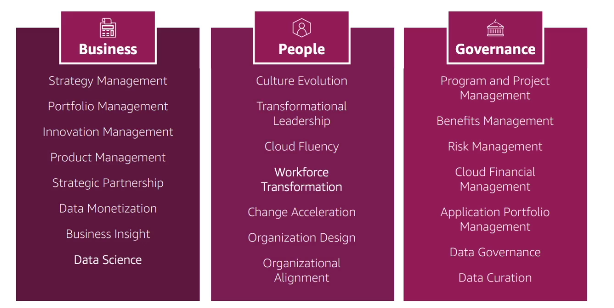
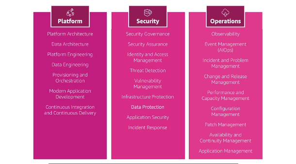
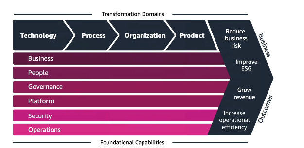

# Well Architected Framework General Guiding Principles

- Stop guessing your capacity needs
- Test systems at production scale
- Automate to make architecture experimentation easier
- Allow for evolutionary architectures
  - design based on changing requirements
- Drive architectures using data
- Improve through game days
  - simulate applications for flash sale days

# AWS Cloud Best Practices - Design Principles

- Scalability: vertical and horizontal
- Disposable Resources: servers should be disposable and easily configured
- Automation: serverless, IaaS, Auto Scaling...
- Loose Coupling:
  - Monolith are applications that do more and more over time, become bigger
  - Break it down into smaller, loosely coupled components
  - a change or a failure in one component should not cascade to other components
- Services, not Servers
  - do not use just EC2

# Well Architected Framework

## 6 Pillars

1. Operational Excellence
2. Security
3. Reliability
4. Performance Efficiency
5. Cost Optimization
6. Sustainability

They are something to balance, they are synergic

### 1 - Operational Excellence

Includes the ability to run and monitor systems to deliver bussiness value and to continually improve supporting and procedures

- Design Principles

  - Perform operations as code - Infrastructure as code (Cloudformation)
  - Make frequent, small, reversible changes - so that in case of any failure, you can reverse it
  - Refine operations procedures frequently - and ensure that team members are familiar with it
  - Anticipate failure
  - Learn from all operational failures
  - Use managed services - to reduce operational burden
  - Implement observability for actionable insights - performance, reliability, costs

- AWS Services
  - **Prepare**: AWS Cloudformation, AWS Config (compliance of Cloudformation templates)
  - **Operate**: AWS Cloudformation, AWS Config, AWS CloudTrail, CloudWatch, AWS X-Ray
  - **Evolve**: AWS Cloudformation, AWS CodeBuild, AWS CodeCommit, AWS CodeDeploy, AWS CodePipeline

### 2 - Security

- includes the ability to protect information systems, and assets while delivering business value through risk assessments and mitigation strategies
- Design Principles

  - implement a strong identity foundation - Centralize privilege management and reduce (or even eliminate) reliance on long-term credentials - Principle of least priviledge - IAM
  - enable traceability - integrate logs and metrics with systems to automatically respond and take action
  - Apply security at all layers - like edge network, VPC, subnet, load balancer, every instance, operating system, and application
  - Automate security best practices
  - Protect data in transit and at rest - encryption, tokenization, and access control
  - keep people away from data - Reduce or eliminate the need for direct access or manual processing of data
  - prepare for security events - run incident response simulations and use tools with automation to increase your speed for detection, investigation and recovery

- AWS Services
  - Identity and Access Management: IAM, AWS-STS, MFA Token, AWS Organizations
  - Detective Controls - AWS Config, AWS CloudTrail, CloudWatch
  - Infrastructure Protection - Amazon CloudFront, VPC, Shield, WAF, Inspector
  - Data Protection - KMS (encrypt data at rest), S3, Elastic Load Balancing, EBS, RDS
  - Incident Response - IAM, AWS CloudFormation, AWS CloudWatch Events

### 3 - Reliability

Ability of a system to recover from infrastructure or service dusruptions, dynamically acquire computing resources to meet demand, and mitigate disruptions or misconfigurations or transient network issues

- Design Principles

  - Test recovery procedures - use automation to simulate different failures or to recreate scenarios that led to failures before
  - Automatically recover from failure - anticipate and remediate failures before they occur
  - Scale horizontally to increase aggregate system availability - distribute requests across multiple, smaller resources to ensure that they don't share a common point of failure
  - Stop guessing capacity - maintain the optimal level to satisfy demand without over or under provisioning - use auto scaling
  - manage change in automation - use automation to make changes to infrastructure

- AWS Services:
  - Foundations: AWS IAM, Amazon VPC, Service Limits (inferior and superior limit), AWS Trusted Advisor
  - Change Management: AWS Auto Scaling, Amazon Cloudwatch, AWS CloudTrail, AWS Config
  - Failure Management: Backups, CloudFormation, S3 (backup data), S3 Glacier, Route 53 (redirect application)

### 4 - Performance Efficiency

Includes the ability to use computing resources efficiently to meet system requirements, and to maintain that efficiency as demand changes and technologies evolve

- Design Principles

  - Democratize advanced technologies - advance technologies become services and hence you can focus more on product development
  - Go global in minutes - easy deployment in multiple regions
  - use serverless architectures - avoid burden of managing servers
  - Experiment more often - easy to carry out comparative testing
  - Mechanical sympathy - Be aware of all AWS services

- AWS Services
  - Selection: AWS Auto Scaling, AWS Lambda, Amazon EBS, Amazon S3, Amazon RDS
  - Review: AWS CloudFormation, AWS News Blog
  - Monitoring: Amazon CloudWatch, AWS Lambda
  - Tradeoffs: Amazon RDS, Amazon ElastiCache, AWS Snowball, Amazon Cloudfront

### 5 - Cost Optimization

Includes the ability to run systems to deliver business value at the lowest price point

- Design Principles

  - adopt a consumption mode - pay for only what you use
  - Measure overall efficiency - use CloudWatch
  - Stop spending money on data center operations - AWS does the infrastructure part and enables customer to focus on organization projects
  - Analyze and attribute expenditure - accurate identification of system usage and costs, help measure return on investiment (ROI) - make sure to use tags
  - Use managed and application level services to reduce cost of ownership - as managed services operate at cloud scale, they can offer a lower cost per transaction or service

- AWS Services
  - Expenditure Awareness: AWS Budgets, AWS Cost and Usage Report, AWS Cost Explorer, Reserved Instance Reporting
  - Cost-effective Resources: Spot Instance, Reserved Instance, Amazon S3 Glacier
  - Matching supply and demand: AWS Auto Scaling, AWS AWS Lambda
  - Optimizing over time: AWS Trusted Advisor, AWS Cost and Usage Report, AWS News Blog

### 6 - Sustainability

The sustainability pillar focuses on minimizing the environmental impacts of running cloud workloads

- Design Principles

  - understand your impact
  - Establish sustainability goals
  - maximize utilization
  - anticipate and adopt new, more efficient hardware and software offerings
  - use managed services
  - reduce the downstream impact of your cloud workloads

- AWS Services
  - EC2 Auto Scaling, Serverless Offering
  - Cost Explorer, AWS Graviton 2, EC2 T instances, Spot instances
  - EFS-IA, Amazon S3 Glacier, EBS Cold HDD volumes
  - S3 lifecycle configurations, S3 intelligent Tiering
  - Amazon Data Lifecycle Manager
  - Read Local, Write Global: RDS Read Replicas, Aurora Global DB, DynamoDB Global Table, CloudFront

## AWS Well-Architected Tool

- free tool to review your architectures against the 6 pillars Well-Architected Framework and adopt architectural best practices
- how does it work
  - select your workload and answer questions
  - review your answers againts the 6 pillars
  - obtain advice: get videos and documentations, generate a report, see the results in a dashboard

## AWS Customer Carbon Footprint Tool

- track, measure, and forecast the Carbon emissions generated from your AWS usage
- helps you meet your sustainability goals

## AWS Cloud Adoption Framework (CAF)

- helps you build and then execute a comprehensive plan for your digital transformation through innovative use of AWS
- Created by AWS Professionals by taking advantage of AWS Best Practices and lessons learned from 1000s of customers
- AWS CAF identifies specific organizational capabilities that underpin successful cloud transformations
- AWS CAF Groups its capabilities in six perspectives: **Business, People, Governance, Platform, Security, and Operations**

### Business Capability

- Business Perspective
- People Perspective - a bridge between technology and business
- Governance Perspective

### Technical Capabilities

- Platform Perspective
- Security Perspective
- Operations Perspective

### AWS CAF - Transformation Domains

- Technology - using the cloud to migrate and modernize legacy infrastructure, applications, data and analytics platforms
- Process - digitizing, automating and optimizing your business applications
- Organization - Reimagining your operating model
- Product - reimaining your business model by creating new value propositions (products and services) and revenue models

### AWS CAF Transformation Phases

- Envision - demonstrate how the Cloud will accelerate business outcomes by identify transformation opportunities and create a foundation for your digital transformation
- Align - identify capability gaps across the 6 AWS CAF Perspectives which results in an Action Plan
- Launch - build and deliver pilot initiatives in production and demonstrate incremental business value
- Scale - expand pilot initiatives to the desired scale while realizing the desired business benefits

## AWS Right Sizing

- EC2 has many instances types, choosing the most powerful instance is not the best choice, bacause cloud is elastic
- Right sizing is the process of matching instance types nad sizes to your workload performance and capacity requirements at the lowest possible cost
- Scaling up is easy so always start small
- it is also de process of looking at deployed instances and identifying opportunities to eliminate or downsize without compromising capacity or other requirements, which results in lower costs
- it is important to Right Size
  - before a Cloud Migration
  - continuously after the cloud onboarding process (requirements change over time)
- CloudWatch, Cost Explorer, Trusted Advisor, 3rd party tools can help

# AWS Ecosystem - Free resources

- AWS Blogs
- AWS Forums (community)
- AWS Whitepapers & Guides
- AWS Partner Solutions (formerly Quick Starts)
  - automated, gold standard deployments in the AWS Cloud
  - Build your production environment quickly with templates
  - Example: WordPress on AWS
  - Leverages CloudFormation
- AWS Solutions
  - Vetted Technology Solutions for the AWS Cloud

# AWS Ecosystem - AWS Support

- Developer
  - business hours email access to Cloud Support Associates
  - General Guidance: < 24 business hours
  - System impaired: < 12 business hours
- Business

  - 24 x 7 phone, email, and chat access to Cloud Support Engineers
  - Production system impaired: < 4 hours
  - Production system down: < 1 hour

- Enterprise
  - Acess to a Technical Account Manager (TAM)
  - Concierge Support Team (for billing and account best practices)
  - Business-critical system down: < 15 minutes

# AWS Marketplace

- digital catalog with thousands of software listing from independent software vendors (3rd party)
- Example:
  - Custom AMI (custom OS, firewalls, technical solutions)
  - CloudFormation templates
  - Software as a Service
  - Containers
- if you through the AWS Marketplae, it goes into your AWS Bill
- you can sell your own solutions on the AWS Marketplace

# AWS Training

- AWS Digital (online) and Classroom Training (in-person or virtual)
- AWS Private training - for your organization
- training and certification for the US Government
- training and certification for the Enterprise

- AWS Academy: helps universities teach AWS

# AWS Professional Services & Partner Network

- The AWS professional services organization is a global team of experts
- they work alongside your team and a choosen member of the APN
- APN = AWS Partner Network
- APN Technology Partners
- APN Consulting Partners
- APN Training Partners
- AWS Competency Program
- AWS Navigate Program

# AWS IQ

- quickly find professional help for your AWS projects
- Engage and pay AWS Certified 3rd party experts for on-demand project work
- Video-conferencing, contract management, secure collaboration, integrated billing
- For Customers:
  - Submit Request -> review responses -> Select Expert -> Work Securely - pay per milestone
- For Experts
  - Create Profile -> Connect with Customers -> Start a proposal -> Work Securely -> Get Paid

# AWS re:Post

- Forum (community)
- AWS managed Q&A service offering crowd-sourced, expert reviewed answers to your technical questions about AWS that replaces the original AWS Forums
- Part of the AWS Free Tier
- Community members can earn reputation points to build up their community experts status by providing accepted answers and reviewing answers from other users
- Questions from AWS Premium support customers that do not receive a response from the community are passed on to AWS Support Engineers
- AWS re:Post is not intended to be used for questions that are time-sensitive or involve any proprietary information

# AWS Knowledge Center

- part of re:Post
- contains the most frequent and common questions and requests

# AWS Managed Services (AMS)

- provides infrastructure and application support on AWS
- AMS offers a team of AWS Experts who manage and operate your infrastructure for security, reliability, and availability
- helps organizations offload routine management tasks and focus on their business objectives
- fully managed service, so AWS handles common activities such as change requests, monitoring, patch management, security and backup services
- implements best practices and maintains your AWS infrastructure to reduce your operational overhead and risk
- AMS business hours are 24/365
- contact sales of AWS
