# Amazon Route 53

A highly available, scalable, fully managed and Authoritative DNS
(the customer can update the DNS records - authoritative)

Route 53 is also a Domain Registrar
Ability to check health of resources
Only AWS service which provides 100% availability SLA

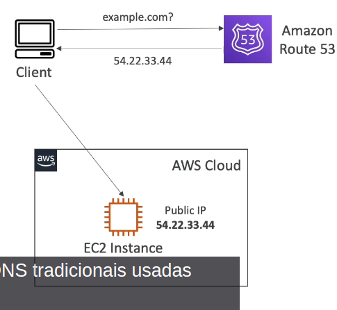

## Records

- how you want to route traffic for a domain
- each record contains:

  - Domain/subdomain name (eg: example.com)
  - record type, A or AAAA
  - value (eg: 12.34.56.78)

- suppport the following DNS Record Types:
  - A / AAAA / CNAME / NS (must know)
  - advanced: CAA / DS / MX / NAPTR / PTR / SOA / TXT / SPF / SRV

## Record Types

- A: maps a hostname to IPv4
- AAAA - maps a hostname to IPv6
- CNAME - maps a hostname to another hostname

  - the target is a domain name which must have an A or AAAA record
  - Can't create a CNAME record for the top node of a DNS namespace

- NS - Name Servers for the Hosted Zone
  - control how traffic is routed to a domain

## Hosted Zones

- A container for records that how to route traffic to a domain and its subdomains
- Public Hosted Zones - contains records that specify how to route traffic on the Internet
- Private hosted Zones - contains records that specify how you route traffic within one or more VPCs
- you pay $0.50 per month per hosted zone

### Public Hosted Zone

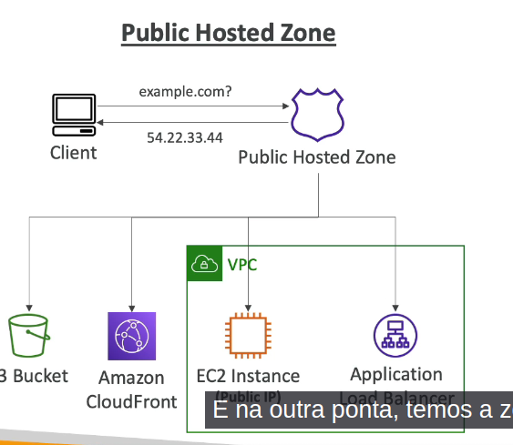
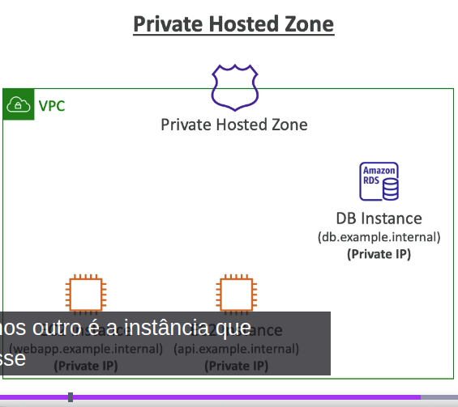

### TTL

Time to live
Time for the record to expire in the CACHE
The query will be issued to the DNS system will be made after TTL

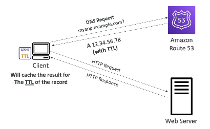

### CNAME

- AWS resources expose hostnames (lb1-1234.us-east-1.elb.amazonaws.com) and you want myapp.mydomain.com
- CNAME:
  - points a hostname to another hostname
  - only works for non root domain (aka.something.mydomain.com)

### Alias

- Points a hostname to an AWS Resource
- works for ROOT Domains an NON ROOT Domain
- Free of charge
- native health check
- extension to DNS funcionalities
- Alias records is always of type A/AAAA for AWS Resources (IPv4 or IPv6)
- You can't set TTL

- Targets:

  - Elastic Load Balancer
  - Cloudfront
  - API Gateway
  - Elastic Beanstalk environments
  - S3 Websites
  - VPC Interface Endpoints
  - Global Accelerator accelerator
  - Route 53 Records in the same hosted zone

- You can not set an alias for an EC2 DNS name

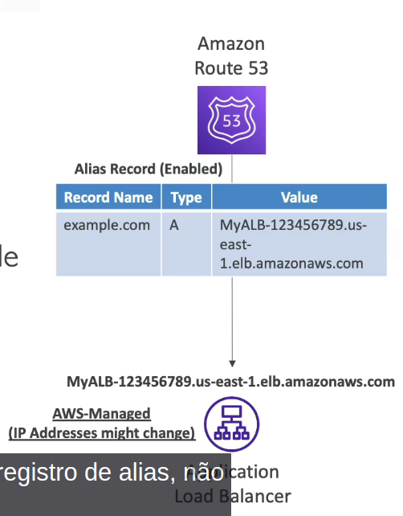

## Routing Policies

- not the same as Load Balancer routes
- how Route 53 responds to DNS queries
- DNS does not route any traffic, it only responds to DNS queries

- Supports the following Routing Policies:
  - simple
  - weighted
  - Failover
  - Latency Based
  - Geolocation
  - Multi-value answer
  - Geoproximity

### Simple

- Route traffic to a single resource
- can specify mulitple values in the same record
- If multiple values are returned, a random one is chosen by the client
- When alias enabled, specify only one AWS resource
- can't be associated with Health Checks

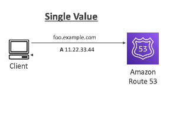

### Weighted

- control the % resources that go to each specific resource
- DNS records must have the same name and type
- Can be associated with Health Checks
- Use cases: load balancing between regions, testing new applications versions
- Assign a weight of 0 to a record will stop sending traffic to a resource

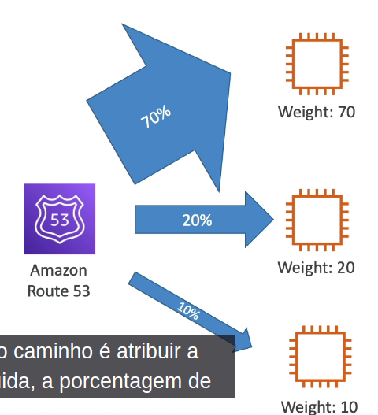

### Latency

- Redirect to the resource which has the least latency
- helpful when latency for users is a priority
- Latency is based on traffic between users and AWS Regions
- can be associated with Health Checks
- can be tested with a VPN

### Health Checks

- are only for public resources

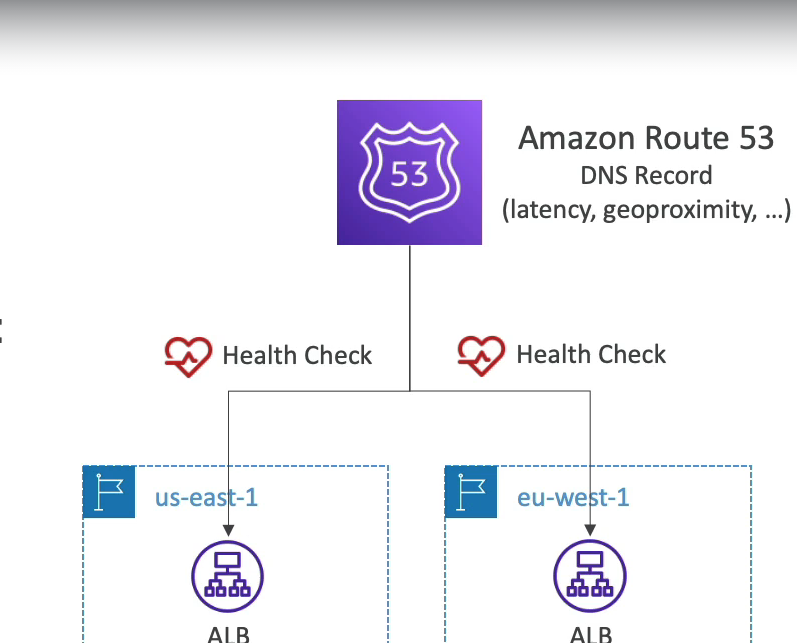

- Automated DNS Failover
  - Health checks that monitor an enpoint
  - monitor other health checks
  - monitor CloudWatch Alarms
- Health Checks are integrated with CW metrics

- you can monitor an endpoint (like /health)
- about 15 global health checkers will check the endpoint health
- Healthy/unhealthy threshold - 3 (default)
- Interval - 30 sec (can set to 10 sec - higher cost)
- Supported protocol - HTTP, HTTPS and TCP
- if > 18% of health checkers report the enpoint is healthy, Route 53 considers it Healthy
- ability to choose which locations you want Route 53 to use

- Health check pass only when response is 2xx or 3xx
- Can be setup to pass / fail based on the text in the first 5120 bytes of the response

- You can combine multiple Health Checks
- You can use OR, AND or NOT
- can monitor up to 256 Child Health Checks
- Specify how many of the health checks need to pass to make the parent pass
- usage: perform maintenance to your website without causing all health checks to fail

- Route 53 health checkers are outside the VPC
- They can't access private endpoints (private VPC or on-premises resources)

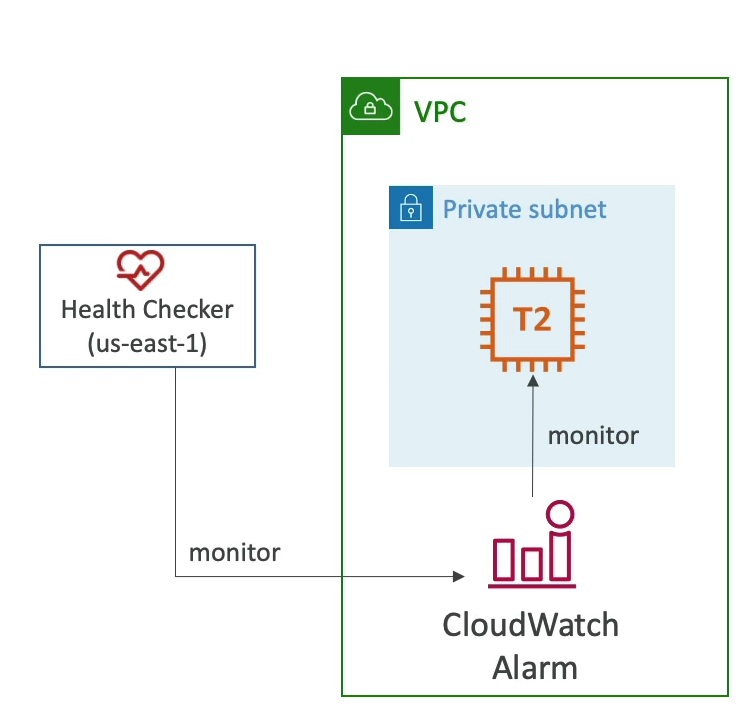

- create a CloudWatch Metric and Associate a CloudWatch Alarm, then create a health check that checks the alarm itself

### Failover (Active-Passive)

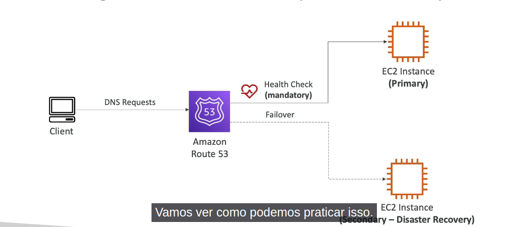

### Geolocation

- Different from Latency-based
- This routing is based on user location
- Specify location by Continent, Country, or by US state
- Should create a "Default" record in case there is no match on location
- use cases: website localization, restrict content distribution, load balancing
- can be associated with Health Checks

### Geoproximity

- route traffic to your resources based on the geographic location of users and resources
- Ability to shift more traffic to resources based on the defined bias
- To change the size of the geographic region, specify bias values:

  - to expand (1 to 99) - more traffic to the resource
  - to shrink (-1 to -99) - less traffic to the resource

- Resources can be:

  - AWS resources (specify AWS region)
  - non-aws resources (specify Latitude and Longitude)

- You must use Route 53 Traffic flow (advanced) to use this feature

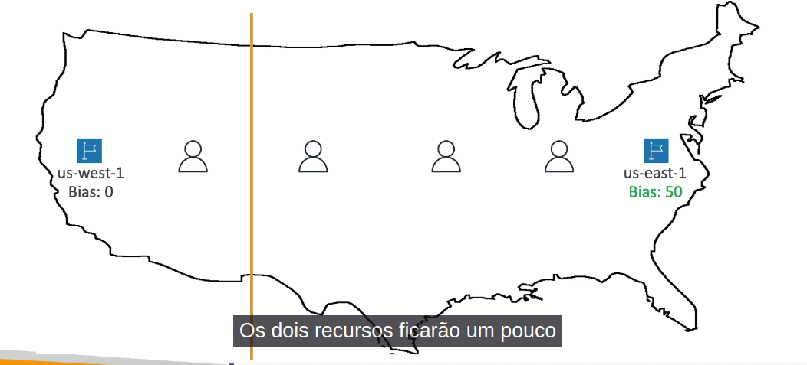
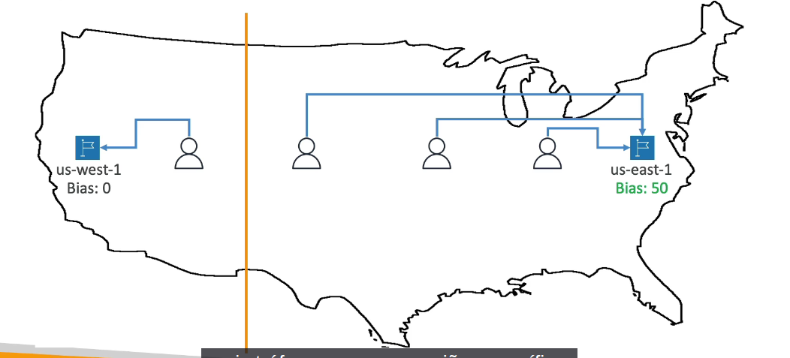

### Route 53 - Traffic Flow

- Simplify the process of creating and maintaining records in large and complex configuration
- visual editor to manage complex routing decision trees
- Configuration can be saved as Traffic Flow Policy
  - can be applied to different Route 53 Hosted Zones (different domain names)
  - Supports versioning

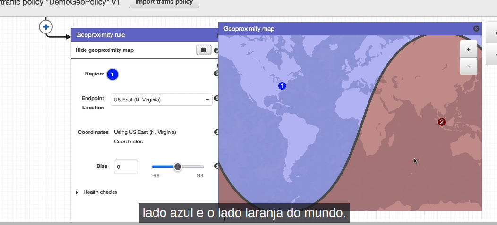

### Ip-based Routing

- Routing is based on client's IP addresses
- You provide a list of CIDRs for your clients and the corresponding endpoints/locations (user-IP to endpoint mappings)
- Use cases: optimize performance, reduce network costs

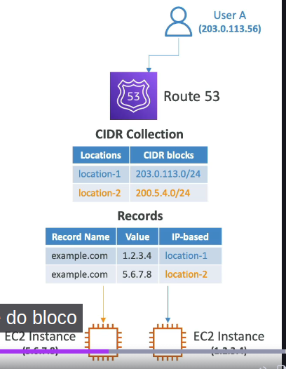

### Multi-Value

- use when routing traffic to multiple resources
- Route 53 reutrn multiple values/resources
- can be associated with Health Checks (return only values for healthy resources)
- Up to 8 healthy records are returned for each Multi-Value query

## Domain Registar vs DNS Service

- You buy or register your domain name with a Domain Registrar typically by paying annual charges (eg: GoDaddy, Amazon Registrar Inc.)
- The Domain Registrar usually provides you with a DNS Service to manage your DNS Records
- but you can use another DNS service to manage your DNS records

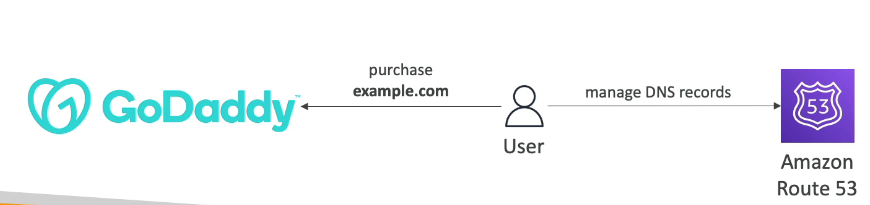

- Create a Hosted Zone in Route 53
- Update NS Records on 3rd party website to use Route 53 Name Servers
