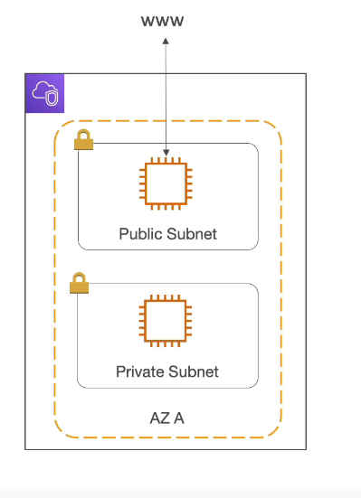
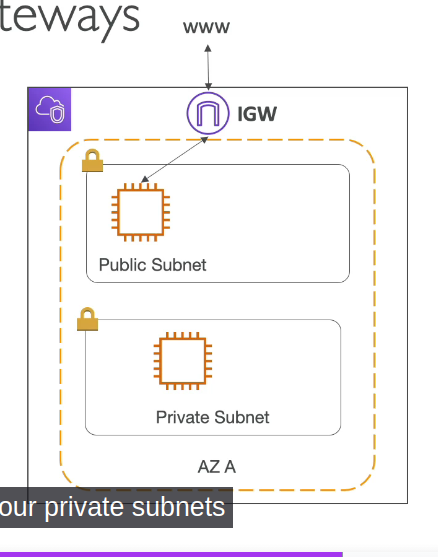
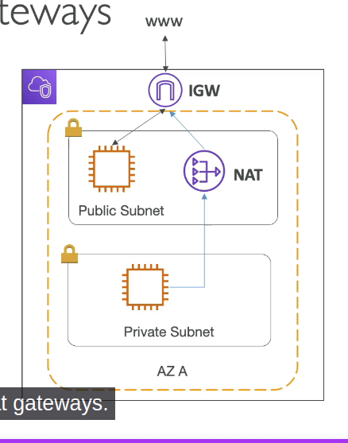
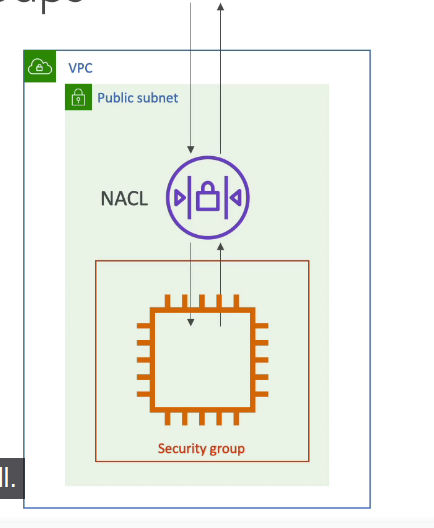
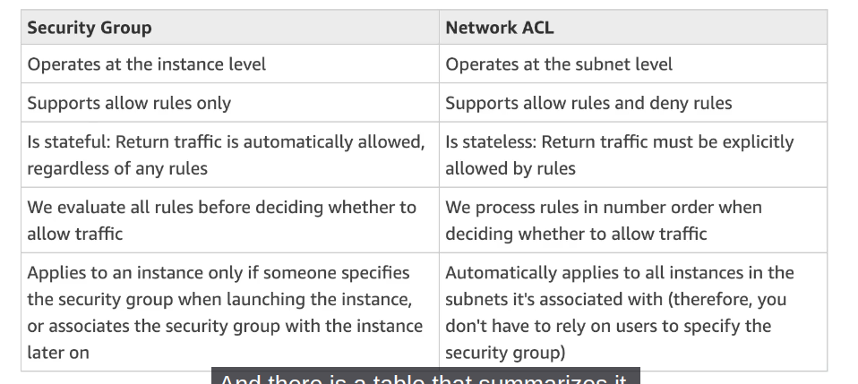
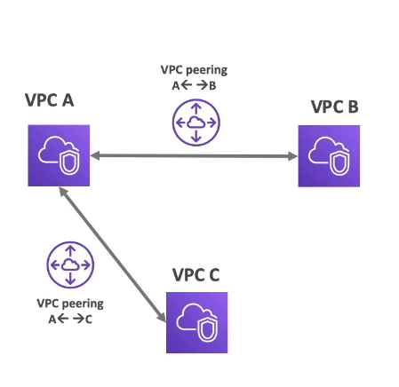
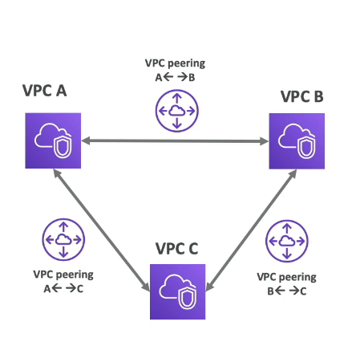
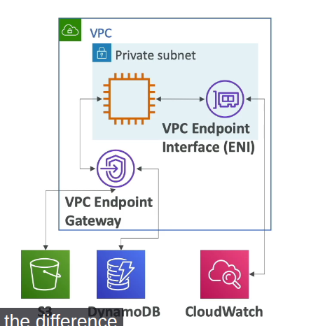
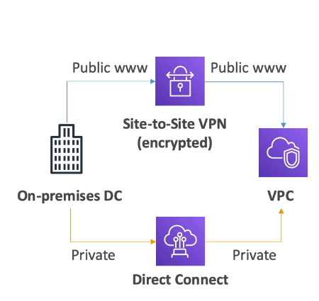
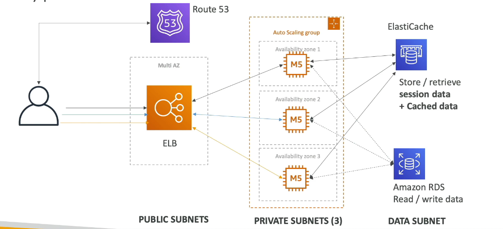

# VPC

Private network to deploy your resourcse (regional resource)

# Subnets

Allow you to partition your network inside your VPC (Availability Zone Resource)

## Public Subnet

is a subnet that is accessible from the internet

## Private Subnet

is a subnet that is not accessible from the internet

to define access to the internet and between subnets, we use Route Tables

VPC has a CIDR Range: 10.0.0.0/16

In Each region you automatically receive on VPC (default VPC), and a public Subnet per availability zone (AZ)

## Internet Gatewasy

- helps our VPC instances connect with the internet
- Public Subnets have a route to the internet gateway

## NAT Gateways and NAT Instances

NAT Gateways (AWS-managed) and NAT Instances (self-managed) allow your instance in Private Subnets to access the internet while remaining Private

## Network ACL & Security Groups

- NACL (Network ACL)

  - a firewall which controls traffic from and to subnet
  - Can have ALLOW and DENY rules
  - Are attached at the **Subnet** level
  - rules that only include IP addresses

- Security Groups
  - a firewall that controls traffic to and from an **ENI/ EC2 Instance**
  - can have only ALLOW rules
  - Rules include IP addresses and other security groups

## VPC Flow Logs

- Capture information about IP traffic going into your interfaces
  - VPC flow logs
  - Subnet flow logs
  - Elastic Network Interface flow logs
- Helps to monitor and troubleshoot connectivity issues

  - subnets to internet
  - subnets to subnets
  - internet to subnets

- Capture network information from AWS managed interfaces too: Elastic Load Balancers, ElastiCache, Aurora...
- VPC flow logs data can go to S3, CloudWatch Logs, and Kinesis Data Firehose

## VPC Peering

- Connect two VPC, privately using AWS network
- Make them behave as if they were in the same network
- Must not have overlapping CIDR (IP address range)
- VPC Peering is not transitive (must be established for each VPC that need to communicate with one another)

## VPC Endpoints

- Endpoints allow you to connect to AWS Services using a private network instead of the public www network
- gives enhanced security and lower latency to access AWS services

- only used within your VPC

- VPC Endpoint Gateway: S3 and DynamoDB
- VPC Endpoint Interface: most services (including S3 & DynamoDB)

## Site to Site VPN and Direct Connect

Connect on-permises datacenter to AWS

### Site to Site VPN

- Connect an on-premises VPN to AWS
- The connection is automatically encrypted
- goes over the public internet

### Direct Connect (DX)

- Establish a physical connection between on-premises and AWS
- the connection is private, secure and fast
- goes over a private network
- takes at least one month to establish

# Summarize

- VPC: Virtual Private Cloud
- Subnets: tied to an AZ, network partition of the VPC
- Internet Gateway: at the VPC level, provide Internet Access
- NAT Gateway / Instances: give internet access to private subnets
- NACL: Stateless, subnet rules for inbound and outbound
- Security Groups: Stateful, operate at the EC2 instance level or ENI
- VPC Peering: connect two VPC with non overlapping IP ranges, non transitive
- VPC Endpoints: provide private access to AWS services within VPC
- VPC Flow Logs: network traffic logs
- Site to Site VPN: VPN over public internet between on-premises DC and AWS
- Direct Connect: direct private connection to AWS

## Typical 3 tier solution Architecture

- Users -> ELB (in a public Subnet)
- User requests Route 53 to know where it should go
- Auto Scaling group will be deployed in a Private Subnets (per AZ)
- Data Subnet: Amazon RDS (Read / write data) and Elasticache (Store / retrieve session data + Cached data)

