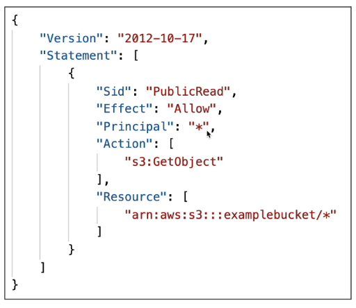
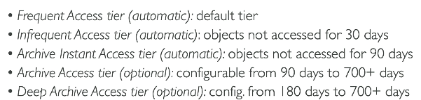
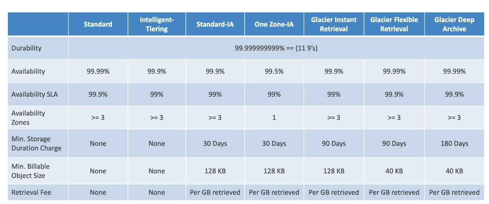

# S3

- is one of the main building blocks of AWS
- it is advertised as "infinite scaling" storage

- Many websites use Amazon S3 as a backbone
- Many AWS services use Amazon S3 as an integration as well

## Use Cases

- Backup and storage
- Disaster recovery
- Archive
- Hybrid cloud storage
- Application hosting
- Media hosting
- Data lakes and Big data analytics
- Software deliveries
- Static website

### Amazon S3 - Buckets

- Amazon S3 enables people to store Objects (files) into Buckets (folders)
- Buckets must have globally unique names (accross all regions all accounts)
- Buckets are defined at the region level
- S3 looks like a global service, but buckets are created in region
- Naming convention:
  - No uppercase, no underscore
  - 3-63 characters long
  - Not an IP
  - must start with lowercase letter or number
  - must NOT start with the prefix xn--
  - must NOT end with the suffix -s3alias

### Amazon S3 - Objects

- Objects (files) have a Key
- The key is the FULL path
- the key is composed by the prefix + object name
- There is no concept of directories within buckets
- just keys with very long names that contain slashes ("/")
- object values are the content of the body

  - Max object size is 5TB (5000GB)
  - If uploading more than 5GB, must use "multi-part upload"

- Metadata (list of text key/ value pairs - system of user metadata)
- Tags (Unicode key / value pair - up to 10) - useful for security / lifecycle
- Version ID (if versioning is enabled)

### Amazon S3 - Security

- User-based

  - IAM Policies - which API calls should be allowed for a specific user from IAM

- Resource-based:

  - Bucket policies - bucket wide rules from the S3 console - allows cross account
  - Objects Access Control List (ACL) - finer grain (can be disabled)
  - Bucket Access Controle List (ACL) - less common (can be disabled)

- Note: an IAM principal can access an S3 object if:

  - the user IAM permissions ALLOW it **OR** the resource policy ALLOWS it
  - **AND** there is no explicity DENY

- Encryption: encrypt objects in Amazon S3 using Encryption Keys

### S3 Bucket Policies

- JSON based policies
  - resources: buckets and objects
  - Effect: ALLOW / DENY
  - Actions: set of API to ALLOW / DENY
  - Principal: account or user to apply the policy to

- use S3 bucket policy to:

  - grant public access to the bucket
  - force objects to be encrypted at upload
  - grant access to another account (Cross account)

- S3 can host a website, if the objects are public, the policies are allowing it, and "Static Website Hosting" is enabled

### AWS S3 Versioning

- you can version your files in Amazon S3
- it is enabled at the **bucket level**
- Same key overwrite, will change the "version"
- it is best practice to version your buckets
  - protect against unintended deletes (ability to restore a version)
  - easy roll back to a previous version
- notes:
  - any file that is not versioned prior to enabling versioning will have version "null"
  - suspending versioning does not delete the previous versions

### AWS S3 - Replication (CRR & SRR)

- Cross Region Replication or Same Region Replication
- Asynchronous replication
- Must enable Versioning in both bucket (source and destination)
- Buckets can be in different AWS accounts
- Copying is asynchronous
- Must give proper IAM permissions to S3

- Use Cases

  - CRR: compliance, lower lattency access, replication across accounts
  - SRR: log aggregation, live replication between production and test accounts

- after you enable replication, only new objects will be replicated
- optionally, you can replicate existing objects using S3 Batch Replication

  - Replicate existing objects and objects that failed replication

- For DELETE operations:

  - can repliate delete markers from source to target (optional setting)
  - Deletions with a version ID are not replicated (to avoid malicious deletes)

- There is no "chaining" of replication
  - if bucket 1 has replication into bucket 2, which has replication into bucket 3
  - then objects in bucket 1 are not replicated into bucket 3

### AWS S3 Storage classes

- AWS S3 Standard - General Purpose
- AWS S3 Standard-Infrequent Access (IA)
- AWS S3 One Zone-Infrequent Access
- AWS S3 Glacier Instant Retrieval
- AWS S3 Glacier Flexible Retrieval
- AWS S3 Glacier Deep Archive
- AWS S3 Intelligent Tiering

- can move between classes manually or using S3 Lifecycle configurations

### S3 Durability and Availability

- Durability

  - High Durability (99.999999999, 11 9's) of object across multiple AZ
  - same for all storage classes

- Availability
  - measure how readily available a service is
  - varies depending on storage class
  - S3 standard: 99.99% of availability = not available 53 minutes a year

### S3 Standard - General Purpose

- 99.99% of availability
- Used for frequently accessed data
- low latency and high throughput
- sustain 2 concurrent fcility failures

- use cases: Big data analytics, mobile and gaming applications, content distribution

### S3 Standard - Infrequent Access

- for data that is less accessed, but require rapid access when needed
- lower cost than S3 standard

- Amazon S3 Standard-Infrequent Access (S3 Standar-IA)

  - 99.9% availability
  - use cases: disaster recoveries, backup

- Amazon S3 One Zone-Infrequent Access (S3 One Zone-IA)
  - data is lost when AZ is destroyed - stored in a single AZ
  - 99.5% Availability
  - Use cases: storing secondary backup copies of on-premise data, data you can recreate

### S3 Glacier Storage Classes

- low-cost (archiving/ backup)
- Pricing: price for storage + object retrieval cost

- Amazon S3 Glacier Instant Retrieval
  - millisecond retrieval, great for data accessed once a quarter
  - minimum storage duration of 90 days
- Amazon S3 Glacier Flexible Retrieval
  - Expedited (1 to 5 minutes), Standard (3 to 5 hours), Bulk (5 to 12 hours) - free
  - minimum storage duration of 90 days
- Amazon S3 Glacier Data Archive - for long term storage
  - Standard (12 hours), Bulk (48 hours)
  - Minimum storage duration of 180 days

### S3 Intelligent Tiering

- Small monthly monitoring and auto-tiering fee
- Moves objects automatically between Access tiers based on usage
- There are no retrieval charges in S3 Intelligent Tiering

