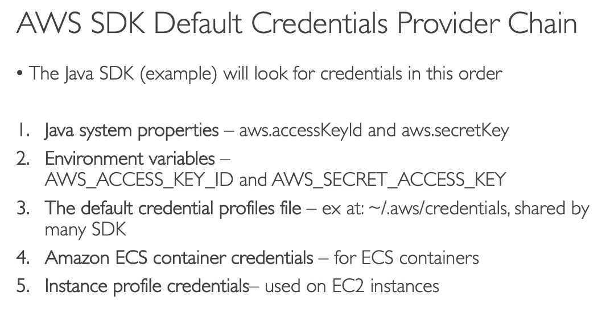
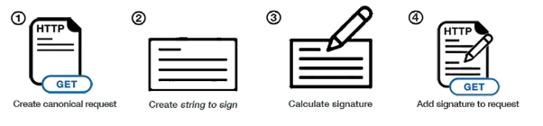

# AWS CLI Credentials Provider Chain

The CLI will look for credentials in this order:

1. Command line options - --region, --output, and --profile
2. Environment variables - AWS_ACCESS_KEY_ID, AWS_SECRET_ACCESS_KEY, and AWS_SESSION_TOKEN
3. CLI Credentials file --aws configure
   ~/.aws/credentials on Linux and Mac or "C:\Users\user\.aws\credentials" on Windows
4. CLI configuration file
5. Container credentials - for ECS tasks
6. Instance profile credentials - for EC2 Instance Profiles

## AWS Credentials Best Practices

- Overall, NEVER EVER STORE AWS CREDENTIALS IN YOUR CODE
- Best practice is for credentials to be inherited from the credentials chain

- if using working within AWS, use IAM Roles:
  - EC2 Instances Roles for EC2 Instances
  - ECS Roles for ECS Tasks
  - Lambda Roles for lambda functions
- if working outside of AWS, use environment variables / named profiles

## Signing AWS API requests

- when you call AWS HTTP API, you sign the request so that AWS can identify you, using your AWS Credentials (access key and secret key)
- note: some requests to Amazon S3 do not need to be signed
- if you use the SDK or CLI, the HTTP requests are signed for you

- you should sign an AWS HTTP request using Signature v4 (SigV4)

- HTTP Header option (signature in Authorization header)
- Query string option, ex: S3 pre-signed URLs (signature in X-Amz-Signature)
