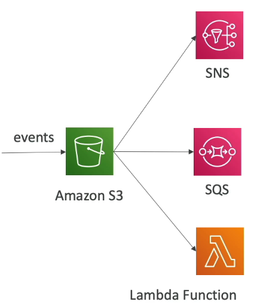
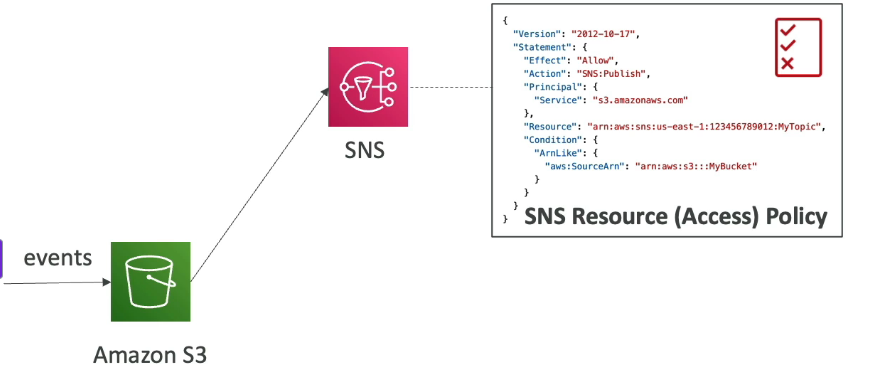

## S3 Event Notifications

- S3:ObjectCreated, S3:ObjectRemoved, S3:ObjectRestore, S3:Replication, ...
- Object name filtering possible (\*.jpg)
- Use Case: generate thumbnails of images uploaded to S3
- can create as many "S3 events" as desired
- typically deliver events in seconds but can sometimes take a minute or longer
- needs the correct IAM permissions
  

  

- attach the IAM permission to the destination (SNS topic, S3, SQS Queue)

- can integrate S3 Event Notification with EventBridge (Which integrates with 18 services - or more)
