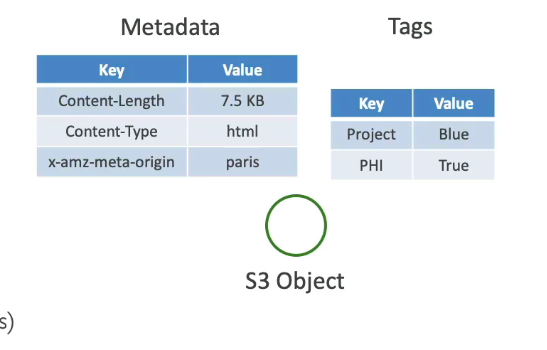

## S3 User-defined Object Metadata

- when uploading an object, you can assign metadata
- name-value (key-value) pairs
- User-defined metadata names must begin with "x-amz-meta-"
- Amazon S3 stores user-defined metadata keys in lowercase
- metadata can be retrieved when retrieving the object

## S3 Object Tags

- key-value pairs for objects in Amazon S3
- useful for fine-grained permissions
- useful for Analytic purposes

- you can not filter by metadata or tags
- you must use and external DB as a search index
