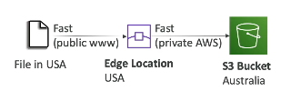
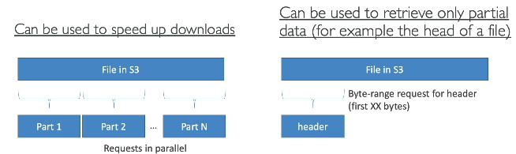

## S3 - Baseline Performance

- Amazon S3 autocamtically scales to high requests rates, latency 100-200 ms
- 3,500 PUT/COPY/POST/DELETE per second
- 5,500 GET/HEAD requests per second per prefix in a bucket
- There is no limit for number of prefixes in your bucket
  - bucket/folder/sub1/file -> prefix is /folder/sub1

## S3 Performance

- Multi-Part Upload

  - recommended for files > 100 mb
  - must use for files > 5gb
  - can help parallelize uploads

- S3 Transfer Acceleration
  - increase transfer speed by transfering file to AWS Edge Location which will forward the data to S3 bucket in the target region
  - compatible with multi-part upload

- S3 Byte-Range Fetches

  - Parellelize GET requests by requesting specific Byte ranges
  - better resilience in case of failures
  - can be used to speed up downloads

