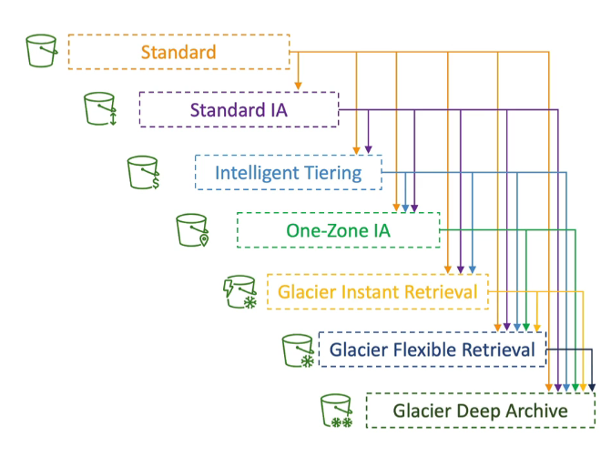

### S3 Storage classes

- you can move objects between storage classes
- for infrequent accessed objects, move them to **Standard IA**
- for archive objects that you don't need fast access to, move them to **Glacier or Glacier Deep Archive**
- moving objects can be automated using **Lifecycle rules**

  

## Lifecycle Rules

- **Transition Actions**: configure objects to transition to another storage class
  - move objects to Standard IA 60 days after creation
- **Expiration Actions**: configure objects to expire (delete) after some time

  - Log files can be set to expire after 365 days
  - can be used to delete old versions of files (if versioning is enabled)
  - can be used to delete incomplete Multi-part uploads

- Rules can be created for a certain prefix
- Rules can be created for certain object Tags (example: Department: Finance)

## Amazon S3 Analytics - Storage Class Analysis

- Help you decide when to transition objects to the right storage class
- Recommendations for Standard and Standard IA
  - does not work for One-Zone IA and Glacier
- Report is updated daily
- 24 to 48 hours to start seeing data analysis
