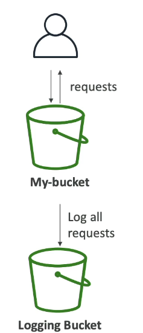

## S3 Audit Logs

- For audit purpose, you may want to log all access to S3 buckets
- Any requests made to S3, from any account, authorized or denied, will be logged into another S3 bucket
- That data can be analyzed using data analysis tools
- The target logging bucket must be in the same AWS region

- The log format is specific, and can be found at AWS documentation

- Warning: do not set your logging bucket to be the monitored bucket
- it will create a logging loop, and your bucket will grow exponentially
