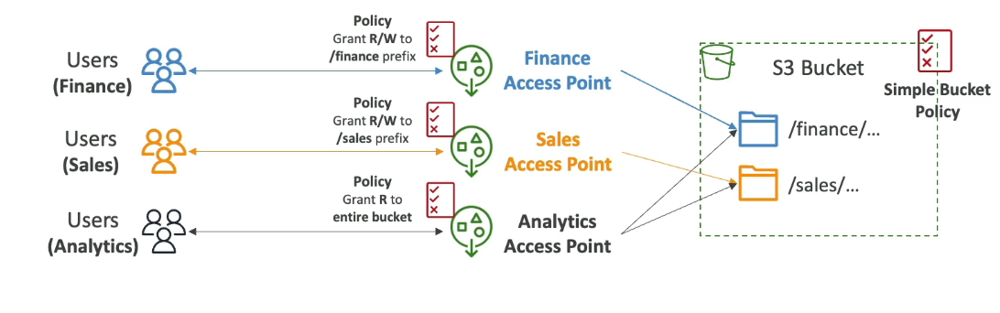
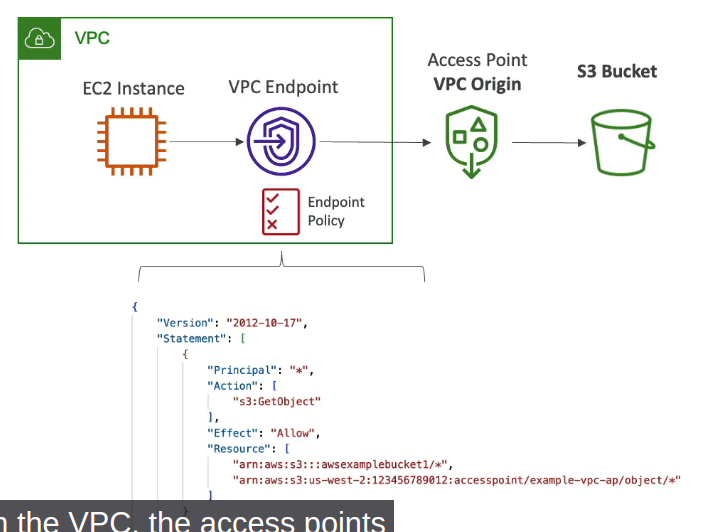
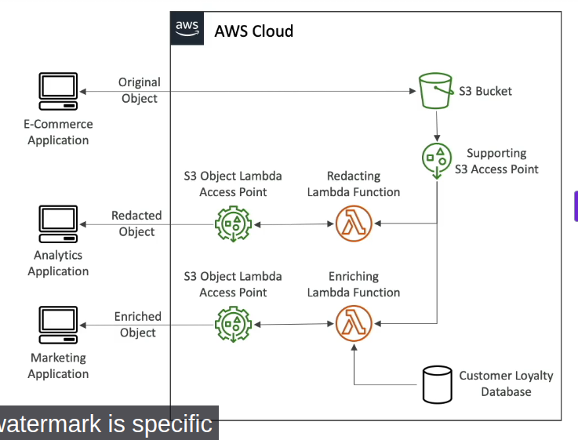

## S3 Access Points

- Access Points simplify security management for S3 Buckets
- Each Access Point has:
  - its own DNS name (Internet Origin or VPC Origin)
  - an access point Policy (similar to bucket policy) - manage security at scale

### S3 Access Points - VPC Origin

- we can define the access point to be accessible only from within VPC

- create a VPC endpoint to access the Access Point (Gateway or Interface Endpoint)
- The VPC endpoint Policy must allow access to the target bucket and Access Point

## S3 Object Lambda

- use AWS Lambda Functions to change the object before it is retrieved by the caller application
- only one S3 bucket is needed, on top of which we create **S3 Access Point** and **S3 Object Lambda Access Points**

- Use cases:
  - Redacting personally identifiable information
  - Converting across data formats, such as converting XML to JSON
  - Resizing and watermarking images on the fly using caller-specific details such as the user who requested the object
