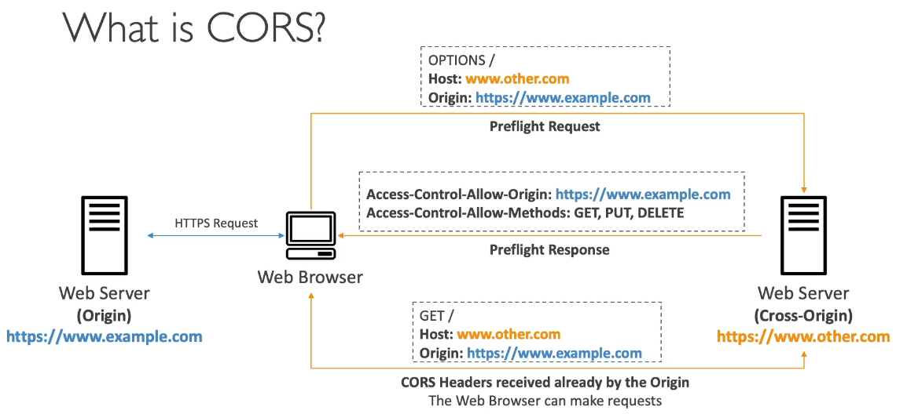
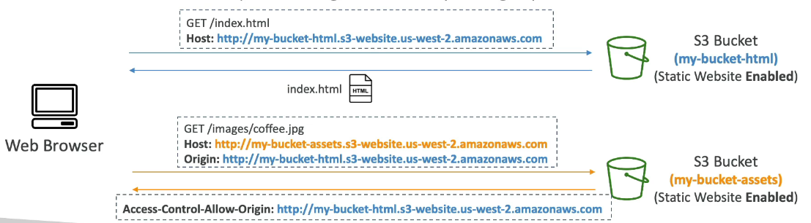

## What is CORS

- Cross-Origin Resource Sharing (CORS)
- Origin = scheme (protocol) + host (domain) + port
  - example: https://www.example.com (implied port is 443 for HTTPS, 80 for HTTP)
- Web Browser based mechanism to allow requests to other origins while visiting the main origin
- Same origin: http://example.com/app1 & http://example.com/app2
- Different origins: http://www.example.com & http://other.example.com
- The request won't be fulfilled unless the other origin allows for the requests, using CORS Headers (example: Access-Control-Allow-Origin)

## Amazon S3 - CORS

- if a client makes a cross-origin request on our S3 bucket, we need to enable the correct CORS headers
- it is a popular exam question
- you can allow for a specific origin or for \* (all origins)

