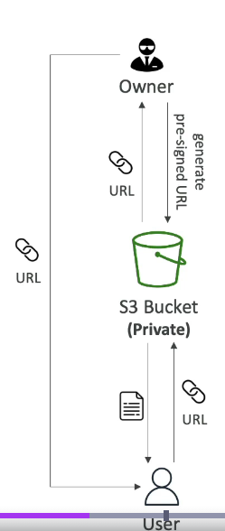

## Amazon S3 - Pre-Signed URLs

- Generate pre-signed URLs using the S3 Console, AWS CLI or SDK
- URL Expiration
  - S3 Console - 1 min up to 720 mins (12 hours)
  - AWS CLI - configure expiration within --expires-in parameter in seconds (default 3600 secs, max. 604800 secs ~ 168 hours)
- Users given a pre-signed URL inherit the permissions of the user that generated the URL for GET / PUT

Examples:

- allow only logged-in users to download a premium video from your S3 bucket
- allow an ever-changing list of users to download files by generating URLs dynamically
- allow temporarily a user to upload a file to a precise location in your S3 bucket
