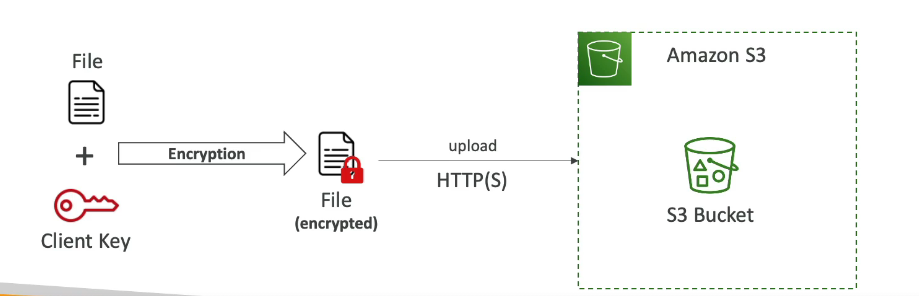
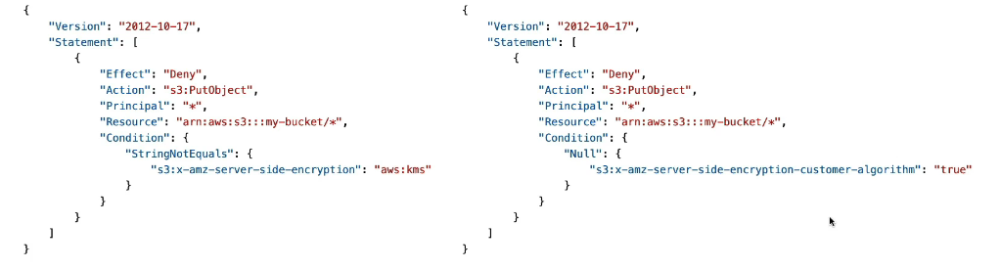

## Amazon S3 - Object Encryption

- you can encrypt objects in S3 in one of 4 methods:

- **Server-Side Encryption (SSE)**
  - Server-Side Encryption with Amazon S3-Managed Keys (SSE-S3) - Enabled by default
  - Server-Side Encryption with KMS Keys stored in AWS KMS (SSE-KMS)
  - Server-Side Encryption with Customer-Provided Keys (SSE-C)
- **Client-Side Encryption**

- Exam: which one is for each situation

### Amazon S3 Encryption - SSE-S3

- Encryption using keys handled, managed and owned by AWS
- Object is encrypted server-side
- Encryption type is AES-256
- Must set header "x-amz-server-side-encryption": "AES256"
- Enabled by default for new buckets and new objects

User -> HTTP(s) + Header -> (Object + S3 Owned Key) -> Encryption -> S3 Bucket

### Amazon S3 Encryption - SSE-KMS

- Encryption using keys handled and managed by AWS KMS (Key Management Service)
- KMS advantages: user control + audit key usage using CloudTrail
- Object is encrypted server side
- Must set header "x-amz-server-side-encryption": "aws:kms"

#### SSE-KMS Limitations

- If you use SSE-KMS, you may be impacted by the KMS limits
- When you upload, it calls the **GenerateDataKey** KMS API
- When you download, it calls the **Decrypt** KMS API
- Count towards the KMS quota per second (5500, 10000, 30000 req/s based on region)
- You can request a quota increase using the Service Quotas Console

### Amazon S3 Encryption - SSE-C

- Server-Side Encryption using keys fully managed by the customer outside of AWS
- Amazon S3 does **NOT** store the encryption key you provide
- HTTPS must be used
- Encryption key must be provided in HTTP headers, for every HTTP request made

### Amazon S3 Encryption - Clien-Side Encryption

- Use client libraries such as Amazon S3 Client-Side Encryption Library
- Clients must encrypt data themselves before sending to Amazon S3
- Clients must decrypt data themselves when retrieving from Amazon S3
- Customer fully manages the keys and encryption cycle

## Amazon S3 - Encryption in transit (SSL/TLS)

- Encryption in flight is also called SSL/TLS
- Amazon S3 exposes two endpoints:

  - HTTP Endpoint: non encrypted
  - HTTPS Endpoint - encryption in flight

- HTTPS is recommended
- HTTPS is mandatory for SSE-C

- you can edit the default encryption for the bucket, which can be override when uploading a object

## Amazon S3 - Default Encryption vs Bucket Policies

- SSE-S3 encryption is automatically applied to new objects stored in S3 buckets
- Optionally you can force encryption using a bucket policy and refuse any API call to PUT an S3 object without encryption headers (SSE-KMS or SSE-C)

- Bucket Policies are evaluated before "Default Encryption"
