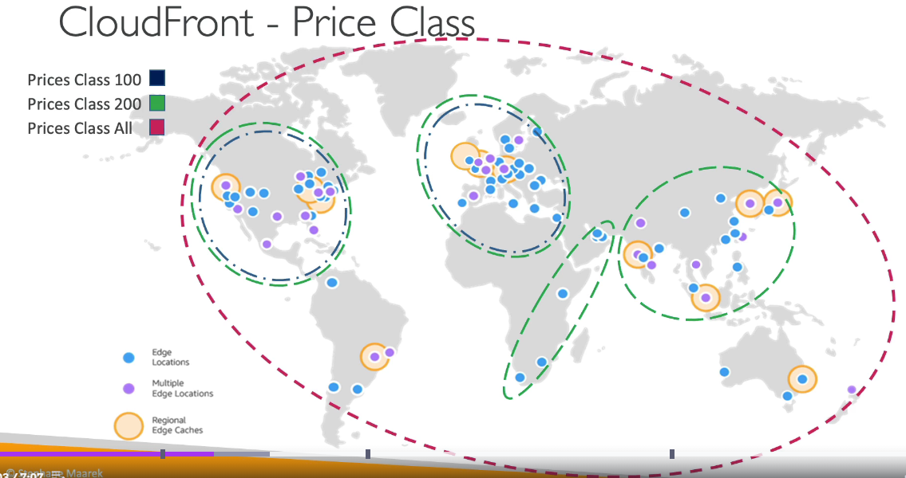

# AWS CloudFront

- Content Delivery Network (CDN)
- Improves read performance, content is cached at the edge
- Improves users experience
- 216 Point of Presence globally (edge locations)
- DDoS protection (because worlwide), integration with Shield, AWS Web Application Firewall

## CloudFront - Origins

- S3 Bucket

  - for distributing files and caching them at the edge
  - for uploading files to S3 through CloudFront
  - Secured using Origin Access Control (OAC)

- VPC Origin

  - for applications hosted in VPC private subnets
  - Application Load Balancer / Network Load Balancer / EC2

- Custom Origin (HTTP)
  - S3 website (must first enable the bucket as a static S3 website)
  - Any public HTTP backend you want

## Cloudfront at a high level

## CloudFront vs S3 Cross Region Replication

- CloudFront:

  - Global Edge Network
  - Files are cached for a TTL (maybe a day)
  - **Great for static content that must be available everywhere**

- S3 Cross Region Replication:
  - Must be setup for each region you want replication to happen
  - Files are updated in near real-time
  - Read only
  - Great for dynamic content that needs to be available at low-latency in few regions

## CloudFront Caching

- The cache lives at each **CloudFront Edge** location
- CloudFront identifies each object in the cache using the **Cache Key**

- you want to maximize the Cache Hit ratio to minimize requests to the origin
- you can invalidate part of the cache using the **CreateInvalidation** API

### CloudFront Cache Key

- a unique identifier for every object in the cache
- by default, consists of **hostname + resource portion of the URL**
- you can add other elements (HTTP headers, Cookies, query strings) to the Cache Key using **CloudFront Cache Policies**

### CloudFront Policies - Cache Policy

- Cache based on:
  - HTTP Headers: None - Whitelist
  - Cookies: None - Whitelist - Include All-Except - All
  - Query Strings: None - Whitelist - Include All-Except - All
- Controle the TTL (0 seconds to 1 year), can be set by the origin using the **Cache-Control** header, **Expires** header
- Create your own policy or use Predefined Managed Policies
- All HTPP headers, cookies, and query strings that you include in the Cache Key are automatically included in origin requests

### CloudFront Policies - Origin Request Policy

- Specify values that you want to include in origin requests without including them in the Cache Key (no duplicated cached content)
- You can include:
  - HTTP headers: None - Whitelist - All viewer headers options
  - Cookies: None - Whitelist - All
  - Query Strings: None - Whitelist - All
- Ability to add CloudFront HTTP headers and Custom Headers to an origin request that were not included in the viewer request
- Create your own policy or use Predefined Managed Policies

## CloudFront - Cache Invalidations

- in case you update the back-end origin, CloudFront doesn't know about it and will only get the refreshed content after the TTL has expired
- However, you can force an entire or partial cache refresh (thus bypassing the TTL) by performing a CloudFront Invalidation
- you can invalidate all files (\*) or a special path (/images/\*)

## CloudFront - Cache Behaviors

- Configure different settings for a given URL path pattern
- Example: one specific cache behavior to images/\*.jpg files on your origin web server
- Route to different kind of origins/origin groups based on the content type or path pattern

- use cases:
  - Login page
  - Maximize cache hits by separating static and dynamic distributions

## CloudFront - ALB or EC2 as an origin

### Using VPC Origins

- most secure way
- Allows you to deliver content from your applications hosted in your VPC private subnets (no need to expose them on the internet)
- Deliver traffic to private:
  - Application Load Balancer
  - Network Load Balancer
  - EC2 Instances

### Using Public Network

- Less Secure
  

## CloudFront Geo Restriction

- You can restrict who can access your distribution

  - Allowlist: Allow your users to access your content only if they are one of the countries on a list of approved countries
  - Blocklist: Prevent your users from accessing your content if they are in one of the countries on a list of banned countries

- The country is determined using a 3rd party Geo-IP database
- Use Case: Copyright Laws to control access to content

## CloudFront Signed URL/Cookies

- you want do distribute paid shared content to premium users over the world
- We can use CloudFront Signed URL / Cookie. We attach a policy with:

  - includes URL expiration
  - includes IP ranges to access the data from
  - Trusted signers (which AWS accounts can create signed URLs)

- Signed URL = access to individual files
- Signed Cookies = acces to multiple files

### CloudFront Signed URL vs S3 Pre-Signed URL

- Cloudfront Signed URL:

  - Allow access to a path, no matter the origin
  - Account wide key-pair, only the root can manage it
  - can filter by IP, path, date, expiration
  - can leverage caching features

- S3 Pre-Signed URL
  - issue a request as the person pre-signed the URL
  - Uses the IAM key of the signing IAM principal
  - limited lifetime

### CloudFront Signed URL Process

- two types of signers:
  - Either a trusted key group (recommended)
    - can leverage APIs to create and rotate keys (and IAM for API security)
  - An AWS Account that contains a CloudFront Key
    - need to manage keys using the root account and the AWS console
    - Not recommended because you shoudn't use the root account for this
- in your CloudFront distribution, create one or more trusted key groups
- Generate your own public / private key
  - the private key is used by our applications to sign URLs
  - the public key is used by CloudFront to verify URLs

## CloudFront - Pricing

- CloudFront Edge locations are all around the world
- the cost of data out per edge location varies

## CloudFront - Price Classes

- you can reduce the number of edge locations for cost reduction
- Three price classes:
  - Price Class All: all regions - best performance
  - Price Class 200: most regions, but exclude the most expensive regions
  - Price Class 100: only the least expensive regions

## CloudFront - Multiple Origin

- to route to different kind of origins based on the content type
- based on path pattern:

  

## CloudFront - Origin Groups

- to increase high-availability and do failover
- origin group: one primary and one secondary origin
- if the primary origin fails, the second one is used

## CloudFront - Field Level Encryption

- Protect user sensitive information through application stack
- Adds an additional layer of security along with HTTPS
- Sensitive information encrypted at the edge close to user
- use asymmetric encryption
- usage:
  - specify set of fields in POST requests that you want to be encrypted (up to 10 fields)
  - specify the public key to encrypt them

## CloudFront - Real Time Logs

- Get real-time requests received by CloudFront sent to Kinesis Data Streams
- Monitor, analyze, and take actions based on content delivery performance
- Allows you to choose:
  - Sampling Rate - percentage of requests for which you want to receive
  - Specific fiels and specific Cache Behaviors (Path Patterns)

