# ECS - Elastic Container Service

## EC2 Launch Type

- Launch Docker Containers on AWS - Launch **ECS Tasks** on ECS Clusters
- EC2 Launch Type - you must provision and maintain the infrastructure (the EC2 instances)
- Each EC2 instance must run the ECS Agent to register in the ECS Cluster
- AWS takes care of starting / stopping containers

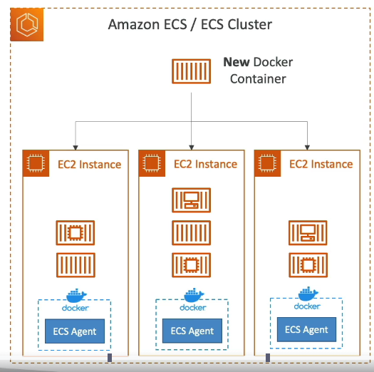

## Fargate Launch Type

- You do not provision the infrastructure (no EC2 instances to manage)
- it's all Serverless
- you just create task definitions
- AWS just runs ECS Tasks for you based on the CPU / RAM you need
- To scale, just increase the number of tasks. Simple - no more EC2 Instances

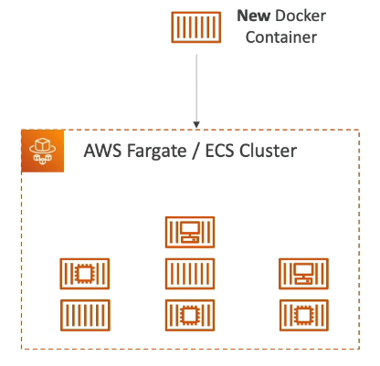

## IAM Roles for ECS

### EC2 Instance Profile (EC2 Launch Type only)

- used by the ECS Agent
- makes api calls to ECS service
- Send container logs to CloudWatch Logs
- Pull Docker Image from ECR
- Reference sensitive data in Secrets Manager or SSM Parameter Store

### ECS Task Role

- allow each task to have a specific role
- use different roles for the different ECS Services you run
- Task Role is defined in the task definition

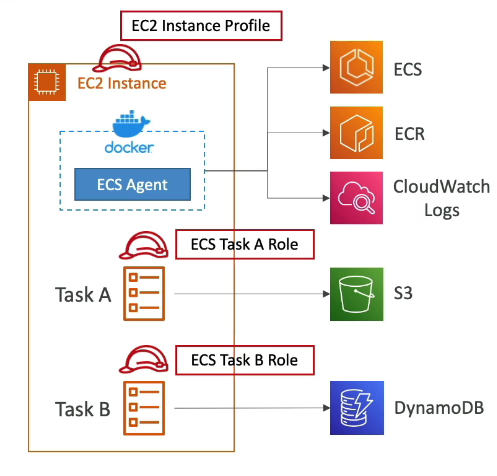

## Load Balancer Integrations

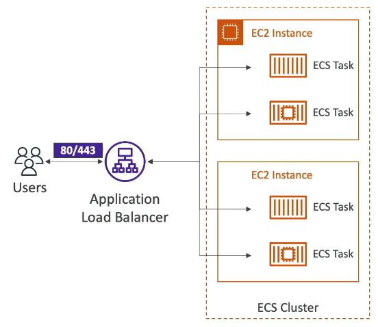

- Application Load Balancer - most use cases
- Network Load Balancer - recommend only for high throughput / high performance use cases, or to pair with AWS Private Link
- Classic Load Balancer supporter but not recommended (no advanced features - no Fargate)

## Data Volumes (EFS)

- Mount EFS File Systems onto ECS tasks
- Works for both EC2 and Fargate launch types
- Tasks running in any AZ will share the same data in the EFS file system

- use cases: persistent multi-AZ shared storage for your containers

- Note: S3 cannot be mounted as a file system

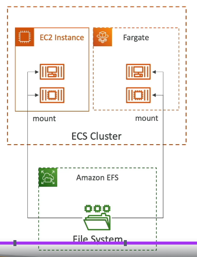

## ECS Service Auto Scaling

- automatically increase/decrease the desired number of ECS tasks
- Amazon ECS Auto Scaling uses **AWS Application Auto Scaling**

  - ECS Service Average CPU Utilization
  - ECS Service Average Memory Utilization - Scale on RAM
  - ALB Request Count Per Targer - metric coming from ALB

- Target tracking - scale based on target value for a specific CloudWatch metric
- Step Scaling - scale based on a specified CloudWatch Alarm
- Schedule Scaling - Scale based on a specified date/time (predictable changes)

- ECS Service Auto Scaling (task level) != EC2 Auto Scaling (EC2 instance level)
- Fargate Auto Scaling is much easier to setup (because Serverless)

### EC2 Launch Type - Scaling

- Auto Scaling Group Scaling
  - scale your ASG based on CPU utilization
  - Add EC2 Instances over time
- ECS Cluster Capacity Provider
  - used to automatically provision and scale the infrastructure for your ECS Tasks
  - Capacity provider paired with and Auto Scaling Group
  - Add EC2 Instances when you are missing capacity (CPU,RAM)

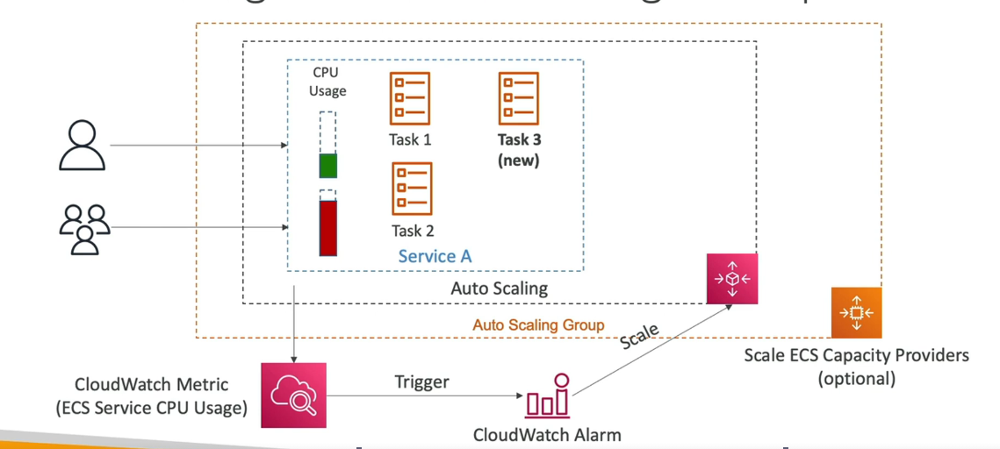

## ECS Rolling Updates

- when updating from v1 to v2, we can controle how many tasks can be started and stopped, and in which order

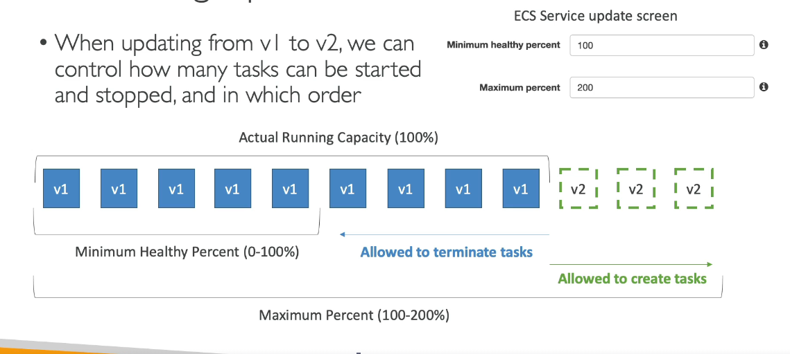

- Example: Min 50%, Max 100%

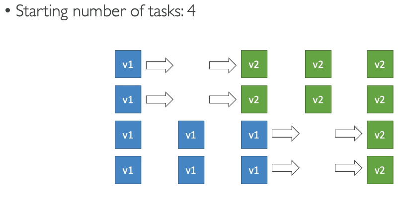

## ECS - Solutions Architectures

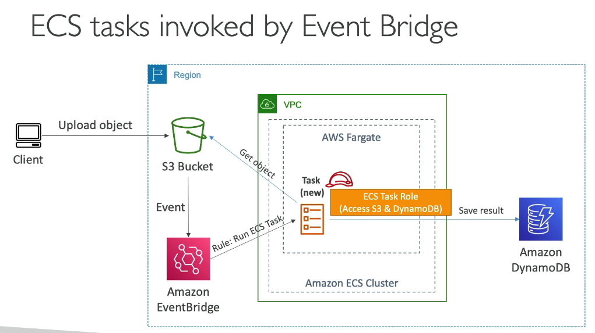

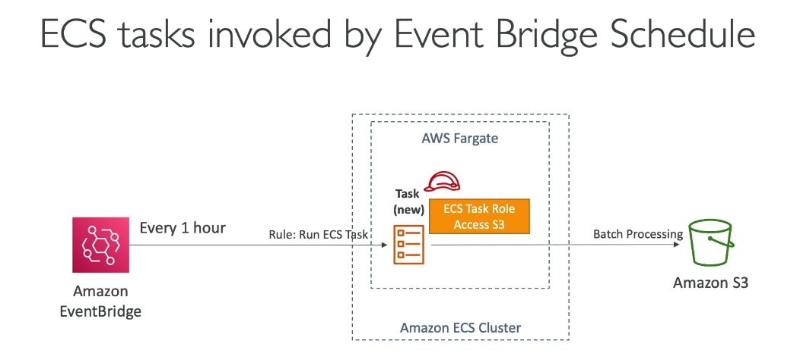

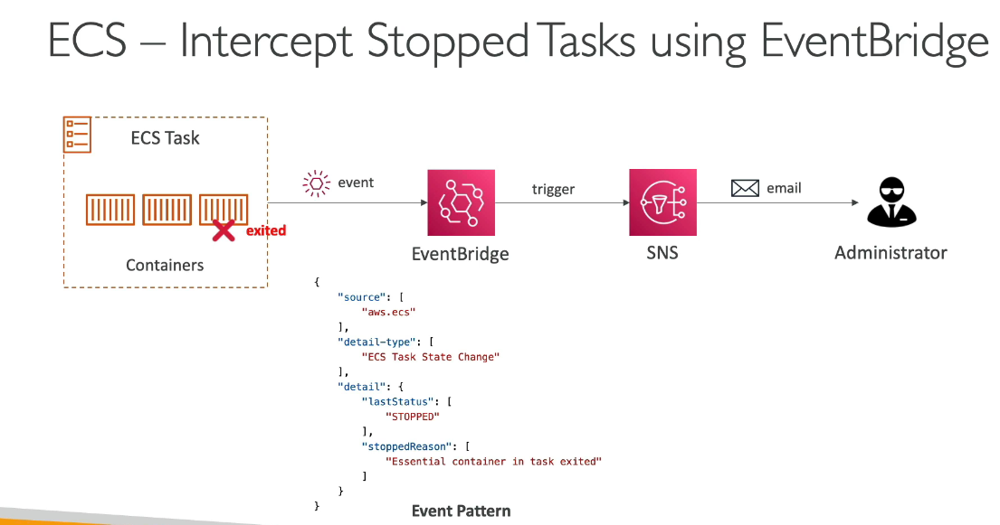

## ECS - Tasks Definitions

- Task definition are metadata in JSON form to tell ECS how to run a Docker container
- it contains crucial information, such as:
  - Image Name
  - Port Binding for Container and Host
  - Memory and CPU required
  - Environment Variables
  - Networking information
  - IAM Role
  - Logging configuration (ex: CloudWatch)
- can define up to 10 containers per Task Definition

## Load Balancing

### EC2 Launch Type

- we get a Dynamic Host Port Mapping if you define only the container port in the task definition
- The ALB finds the right port on your EC2 Instances
  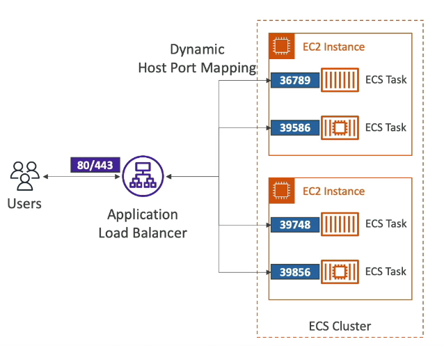
- you must allow on the EC2 Instance's Security Group any port from the ALB's Security Group

### Fargate

- each task has a unique private IP
- only define the container port (host port is not applicable)

- Example
  - ECS ENI Security Group
    - allow port 80 from ALB
  - ALB Security Group
    - allow port 80/443 from web

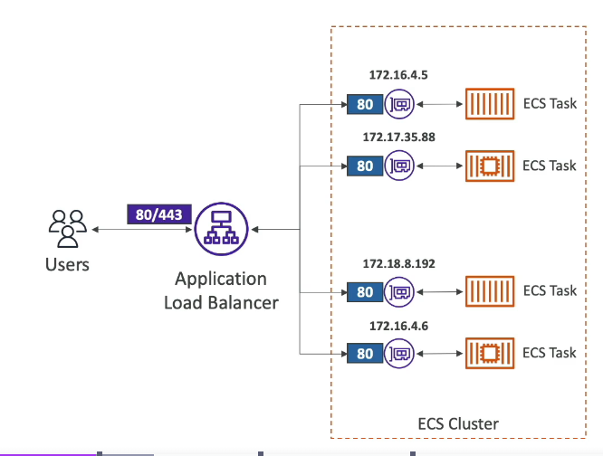

### One IAM Role per Task Definition

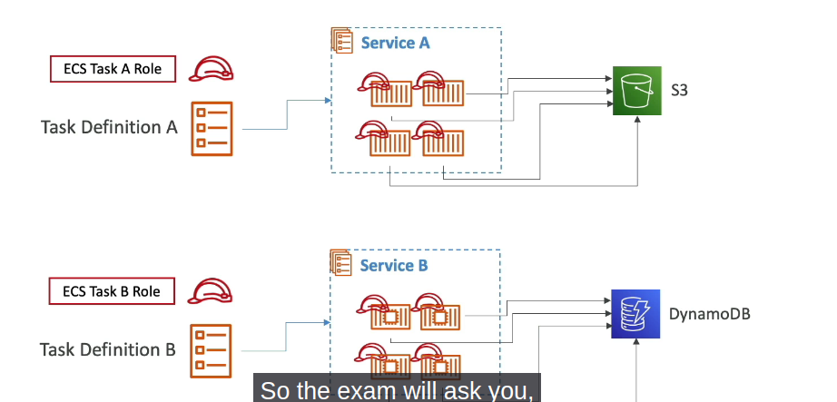

- The IAM Role is defined at the Task Definition Level

### Environment Variables

- Hardcoded - URL
- SSM Parameter Store - sensitive variables (API keys, shared configs)
- Secrets Manager - sensitive variables (DB passwords)

- Environment Files (bulk) - Amazon S3

### Data Volumes - Bind Mounts

- Share Data between multiple containers in the same Task Definition
- Works for both EC2 and Fargate tasks
- EC2 Tasks - using EC2 Instance Storage
  - Data are tied to the lifecycle of the EC2 Instance
- Fargate Tasks - usign ephemeral storage
  - data are tied to the container using them
  - 20 GB - 200 GB (default 20GB)

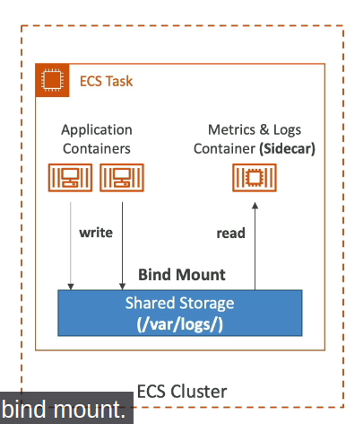

- use cases:
  - share data between multiple containers
  - Sidecar container Pattern

# Amazon ECR

- Docker Container Registry
- Store and manage Docker Images on AWS
- Private and Public repository (Amazon ECR Public Gallery)
- Fully integrated with ECS, backed by Amazon S3
- Access is controlled through IAM (permission errors => policy)

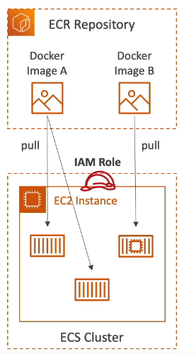

- supports image vulnerability scanning, versioning, image tags, image lifecycle

## AWS Copilot

- CLI tool to build, release and operate production-ready containerized apps
- Run your apps on AppRunner, ECS and Fargate
- Helps you focus on building apps rather than setting up infrastructure
- Provisions all required infrastructure for containerized apps
- Automated deployments with one command using CodePipeline
- Deploy to multiple environments
- Troubleshooting, logs, health status

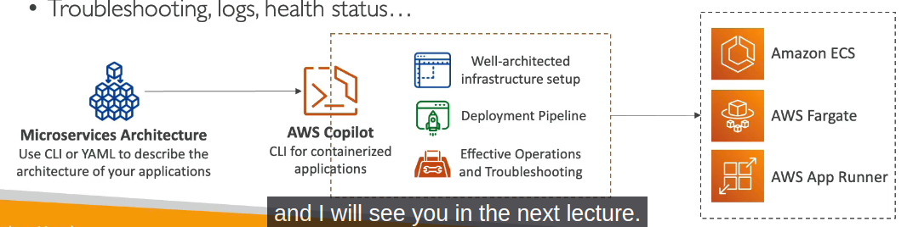

# Amazon EKS

- Amazon Elastic Kubernetes Service
- It is a way to launch managed Kubernetes on AWS
- Kubernetes is an open-source system for automatic deployment, scaling and management of containerized application
- it is an alternative to ECS, similar goal but different API
- EKS supports EC2 if you want to deploy worker nodes or Fargate to deploy serverless containers
- Kubernetes is cloud-agnostic (can be used in any Cloud)

- Node Types

  - Managed Node Groups
  - Self-Managed Nodes
  - AWS Fargate
    - No Maintenance required

- Data Volumes
  - Need to specify StorageClass manifest on your EKS Cluster
  - Leverages a Container Storage Interface (CSI) compliant driver
  - Supports for:
    - Amazon EBS
    - Amazon EFS (works with Fargate)
    - Amazon FSx for Lustre
    - Amazon FSx for NetApp ONTAP
