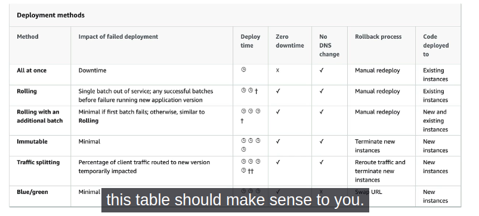

# Beanstalk

## Deployment Modes

- All at once (deploy in one go) - fastest but instances aren't available to serve traffic for a bit (downtime)
- Rolling: update a few instances at a time (bucket), and then move onto the next bucket once the first bucket is healthy
- Rooling with additional batches: like rolling, but spins up new instances to moce the batch (so that the old application is still available)
- Immutable: spins up new instances in a new ASG, deploys version to theses instances, and then swaps all the instances when everything is healthy
- Blue Green: create a new environment and switch over when ready (using Route 53, for example)
- Traffic Splitting: canary testing - send a small % of traffic to new deployment

## Elastic Beanstalk CLI

- additional CLI "EB cli"
- makes working with Beanstalk from the CLI easier
- Basic Commands are:
  - eb create
  - eb status
  - eb health
  - eb events
  - eb logs
  - eb open
  - eb deploy
  - eb config
  - eb terminate
- helps for automating deployment pipelines

- needs to describe dependencies, package code as zip
- console: upload zip file, and then deploy
- CLI: create new app version using CLI and then deploy

- Elastic Beanstalk will deploy the zip on each EC2 instance, resolve dependencies and start the application

## Beanstalk Lifecycle Policy

- Elastic Beanstalk can store at most 1000 applications versions
- if you don't remove old versions, you won't be able to deploy anymore
- to phase out old application versions, use a lifecycle policy
  - based on time
  - based on space
- versions that are currently used won't be deleted
- Option not to delete the source bundle in S3 to prevent data loss

## Beanstalk Extensions

- A zip file containing our code must be deployed to Elastic Beanstalk
- All the parameters set in the UI can be configured with code using files
- Requirements:
  - in the .ebextensions/ directory in the root of source code
  - YAML or JSON format
  - .config extensions
  - able to modify some default settings using: option_settings
  - ability to add resources such as RDS, ElastiCache, DynamoDB, etc
- Resources managed by .ebextensios get deleted if the environment goes away

## Beanstalk under the hood

- Elastic Beanstalk relies on CloudFormation
- CloudFormation is used to provision other AWS services
- use case: you can define CloudFormation resources in your .ebextensions to provision ElastiCache, an S3 bucket, anything you want!

## Elastic Beanstalk Cloning

- Clone an environment with the exact same configuration
- Useful for deploying a "test" version of your application
- All resources and configuration are preserved

  - Load Balancer type and configuration
  - RDS database type (but the data is not preserved)
  - Environment variables

- After cloning an environment, you can change settings

## Elastic Beanstalk Migration: Load Balancer

- After creating an Elastic Beanstalk environment, you cannot change the Elastic Load Balancer type (only the configuration)
- To migrate:
  1. create a new environment with the same configuraion except LB
  2. deploy you application onto the new environment
  3. perform a CNAME swap or Route 53 update

## RDS with Elastic Beanstalk

- RDS can be provisioned with Beanstalk, which is great for dev/test
- this is not great for prod as the database lifecycle is tied to the Beanstalk environment lifecycle
- The best for prod is to separately create an RDS database and provide our EB application with the connection string

## Elastic Beanstalk Migration: Decouple RDS

- Create a snapshot of RDS DB (as a safeguard)
- Go to the RDS console and protect the RDS database from deletion
- Create a new Elastic Beanstalk environment, without RDS, point your application to existing RDS
- perform a CNAME swap (blue/green) of Route 53 update, confirm working
- Terminate the old environment (RDS won't be deleted)
- Delete CloudFormation stack (in DELETED_FAILED state)
