# CloudFormation

- CloudFormation is a declarative way of outlining your AWS Infrastructure, for any resources (most of them are supported)
- The resources are created in the **right order**, with **exact configuration** that you specify

## Benefits

### Infrastructure as Code

- no resources are manually created, which is excellent for control
- The code can be version controlled for example using Git
- Changes to the infrastructure are reviewed through code

### Cost

- each resources within the stack is tagged with an identifier so you can easily see how much a stack costs you
- you can estimate the costs of your resources using the CloudFormation Template
- Saving strategy: in Dev: you could automate deletion of templates at 5 PM and recreation at 8 AM, safely

### Productivity

- ability to destroy and recreate an infrastructure on the cloud on the fly
- automated generation of Diagram for your templates
- Declarative programming (no need to figure out ordering and orchestration)

### Separation of concern: create many stacks for many apps, and many layers

Ex:

- VPC stacks
- Network stacks
- App stacks

### Don't reinvent the wheel

- leverage existing templates on the web
- Leverage the documentation

## How does CloudFormation works

- Templates must be uploaded in S3 and then referenced in CloudFormation
- To update a template, we can't edit previous ones. We have to re-upload a new version of the template to AWS
- Stacks are identified by a name
- Deleting a stack deletes every single artifact that was created by CloudFormation.

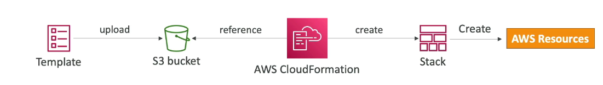

## Deploying CloudFormation Templates

### Manual Way

- editing template in Infrastructure Composer or code editor
- using the console to input parameters, etc
- we'll mostly do this way in the course for learning purposes

### Automated way

- editing templates in a YAML file
- Using the AWS CLI to deploy the templates, or using a Continuos Delivery (CD) tool

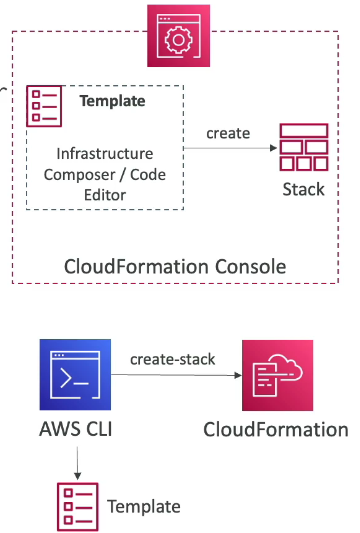

## CloudFormation - Building Blocks

- Template's components:

  - AWSTemplateFormatVersion - identifies the capabilities of the template "2010-09-09"
  - Description - comments about the template
  - Resources (MANDATORY) - your AWS resources declared in the template
  - Parameters: dynamic inputs for your template
  - Mappings: static variables for your template
  - Outputs: references to what has been created
  - Conditionals: list of conditions to perform resource creation

- Template's Helpers
  - References
  - Functions

## YAML

- YAML and JSON are the languages you can use for CloudFormation

### YAML Document

- key/value pairs
- Nested Objects
- Supports Arrays
- Support Multi line strings
- Can include Comments

## CloudFormation - Resources

- Resources are the core of your CloudFormation template (MANDATORY)
- They represent the different AWS Components that will be created and configured
- Resources are created and can reference each other

- AWS figures out creation, updates and deletes of resources for us
- There are over 700 types of resources
- Resources types identifiers are of the Form:

  - service-provider::service-name::data-type-name

- A Dynamic number of resources can be created
  - using CloudFormation Macros and Transform
- Is every AWS Services supported?
  - almost, only few niches are not there yet
  - you can work around that using CloudFormation Custom Resources

## CloudFormation - Parameters

- Parameters are a way to provide inputs to your AWS CloudFormation template
- They are important to know about if:
  - you want to reuse your templates across the company
  - Some inputs can not be determined ahead of time
- Parameters are extremely powerful, controlled, and can prevent errors from happening in your templates, thanks to types

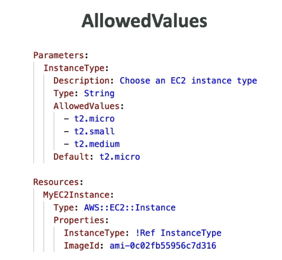

- To reference a parameter, use the Fn::Ref function.
- Parameters can be used anywhere in a template
- The shorthand for this in YAML is !Ref
- The function can also reference other elements within the template

## CloudFormation - Pseudo Parameters

- AWS offers us Pseudo Parameters in any CloudFormation template
- These can used at any time and are enabled by default

## CloudFormation - Mapping

- Mappings are fixed variables within your CloudFormation template
- They are very handy to differentiate between different environments (dev vs prod), regions (AWS regions), AMI types
- All the values are hardcoded within the template

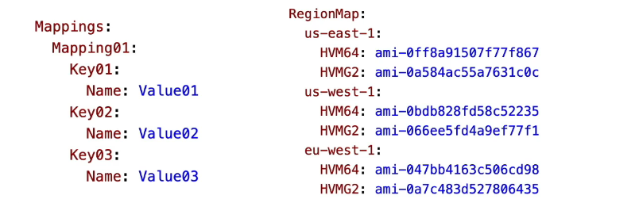

- We use Fn::FindInMap to return a named value from a specific key
- !FindInMap [ MapName, TopLevelKey, SecondLevelKey ]

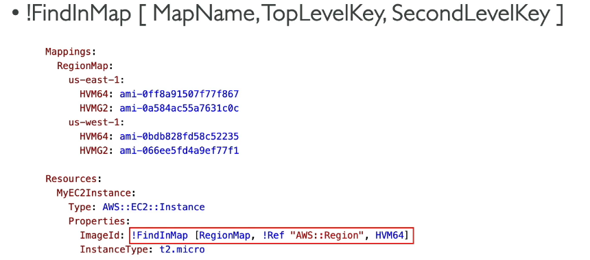

- Great when you know in advance all the values that can be taken and that they can deduced from variables such as: region, Availability Zone, AWS Account, Environment
- They allow safer control over template
- use parameters when the values are really user specific

## CloudFormation - Outputs

- The Outputs section declares optional outputs values that we can import into other stacks
- You can also view the outputs in the AWS Console or in using the AWS CLI
- Useful for example if you define a network CloudFormation, and output variables such as VPC ID and your Subnet IDs

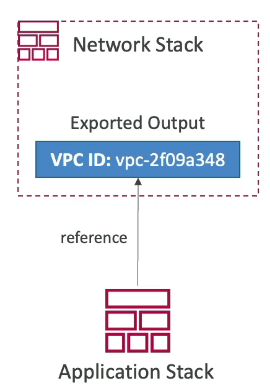

- We need to import use Fn::ImportValue

## CloudFormations - Conditions

- Conditions are used to control the creation of resources or outputs based on a condition
- Conditions can be whatever you want them to be, but common ones are:

  - Environments
  - AWS Region
  - Any parameter value

- "!Equals [ !Ref EnvType, prod ]"

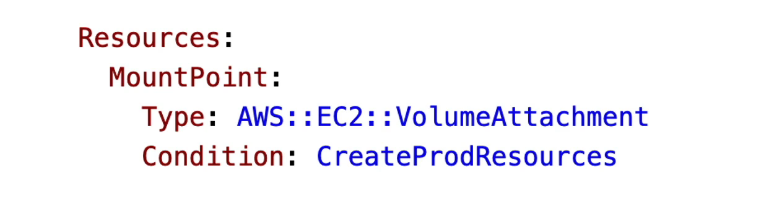

## CloudFormation - Intrinsic Functions

- **Ref**
- **Fn::GetAtt**
- **Fn::FindInMap**
- **Fn::ImportValue**
- Fn::Join
- Fn::Sub
- Fn::ForEach
- Fn::ToJsonString
- **Condition Functions** (Fn::If, Fn::Not, Fn::Equals, etc)
- **Fn::Base64**
- Fn::Cidr
- Fn::GetAZs
- Fn::Select
- Fn::Split
- Fn::Transform
- Fn::Length

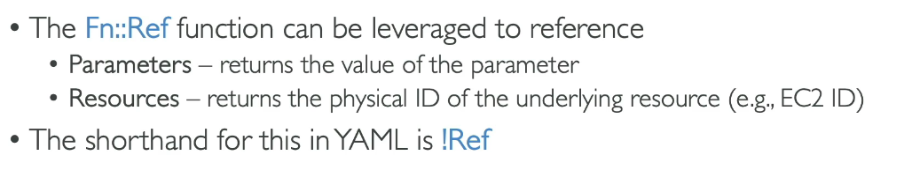

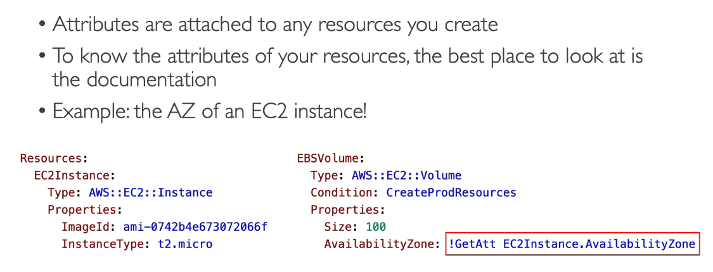

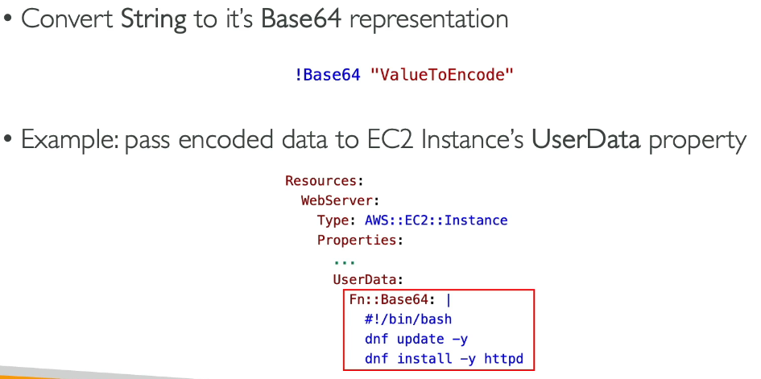

## CloudFormation - Rollbacks

- Stack Creation fails:

  - default: everything rolls back (gets deleted). We can look at the log
  - Option to disable rollback and troubleshoot what happened.

- Stack Update Fails:

  - the stack automatically rolls back to the previous known working state
  - Ability to see in the log what happened and error messages

- Rollback Failure? Fix resource manually then issue "ContinueUpdateRollback" from Console or from cli

## CloudFormation - Service Role

- IAM role that allows CloudFormation to create/update/delete stack resources on your behalf
- Give ability to users to create/update/delete the stack resources even if they don't have permissions to work with the resources in the stack
- Use cases:
  - you want to achieve the least privilege principle
  - but you don't want to give the user all the required permissions to create the stack resources
    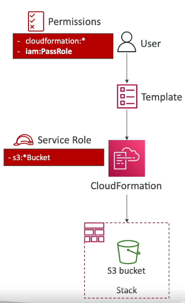
- User must have **iam:PassRole** permissions

## CloudFormtion Capabilities

### **CAPABILITY_NAMED_IAM** and **CAPABILITY_IAM**

- Necessary to enable when you CloudFormation template is creating or updating IAM resources (IAM User, Role, Group, Policy, Access Keys, Instance Profile)

### **CAPABILITY_AUTO_EXPAND**

- Necessary when your CloudFormation template includes Macros or Nested Stacks (stacks within stacks) to perform dynamic transformations
- You are acknoledging that your template may change before deploying

### InsufficientCapabilitiesException

- Exception that will be thrown by CloudFormation if the capabilities haven't been acknowledged when deploying a template (security measure)

## CloudFormation - DeletionPolicy Delete

- DeletionPolicy:
  - Control what happens when the CloudFormation template is deleted or when a resource is removed from a CloudFormation template
  - Extra safety measure to preserve and backup resources
- Default **DeletionPolicy=Delete** (resource is deleted when the template is deleted)

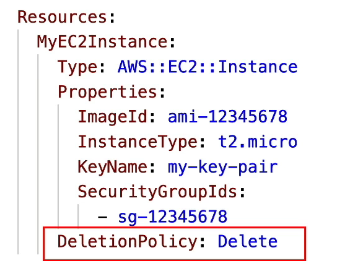

- **Delete** won't work on an S3 buckef if the bucker is not empty

- DeletionPolicy=Retain

  - specify on resources to preserve in case of CloudFormation Deletes
  - works with any resources

- DeletionPolicy=Snapshot
  - create one final snapshot before deleting the resource
  - Examples of supported resources:
    - EBS Volumes, ElastiCache Cluster, ElastiCache ReplicationGroup
    - RDS DBInstance, RDS DBCluster, Redshift Cluster, Neptune DBCluster, DocumentDB DBCluster

## CloudFormation Stack Policies

- During a CloudFormation Stack update, all update actions are allowed on all resources (default)
- **A Stack Policy is a JSON document that defines the update actions that are allowed on specific resources during Stack updates**
- Protect resources from unintentional updates
- When you set a Stack Policy, all resources in the Stack are protected by default
- Specify an explicit ALLOW for the resources you want to be allowed to be updated

## CloudFormation - Termination Protection

- To prevent accidental deletes of CloudFormation Stacks, use TerminationProtection

## CloudFormation - Custom Resources

- Used to
  - define resources not yet supported by CloudFormation
  - define custom provisioning logic for resources can that be outside of CloudFormation (on-premises resources, 3rd party resources)
  - have custom scripts run during create / update / delete through Lambda funcions (running a Lambda funcion to empty an S3 bucket before being deleted)
- Define in the template using **AWS::CloudFormation::CustomResource** or **Custom::MyCustomResourceTypeName** (recommended)
- Backed by a Lambda Function or an SNS topic

### How to define a Custom Resource

- ServiceToken specifies where CloudFormation sends requests to, such as Lambda ARN or SNS ARN (required & must be in the same region)
- Input data parameters (optional)

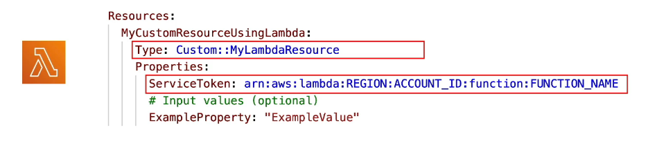

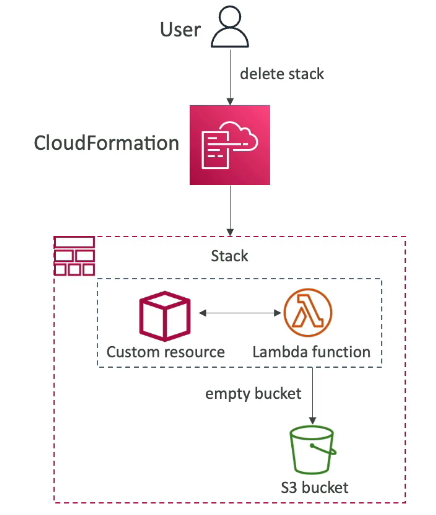

## CloudFormation - StackSets

- Create, update or delete stacks across multiple accounts and regions with a single operation/template
- Target accounts to create, update, delete stack instances from StackSets
- When you update a stack set, all associated stack instances are updated throughout all accounts and regions
- Can be applied into all accounts of an AWS Organization
- Only Administrator account (or Delegated Administrator) can create StackSets

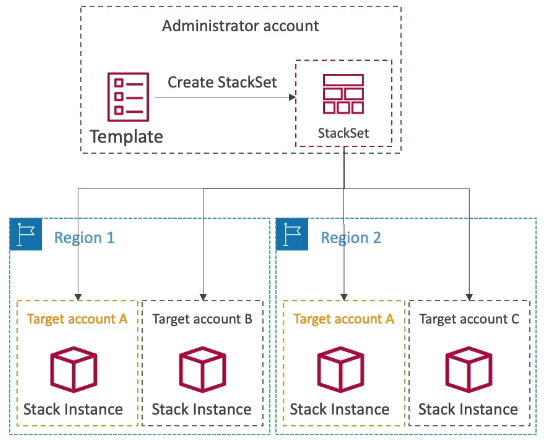
