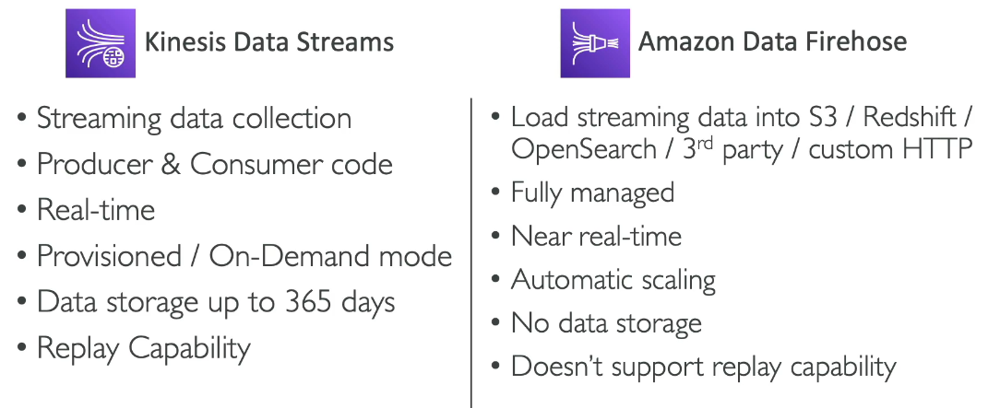

# Amazon Kinesis Data Streams

- Collect and store streaming data in **real-time**

- Real time data (Example: click streams, IoT devices, Metrics & Logs)
- Producers (Applications or Kinesis Agent)
- Send to Amazon Kinesis Data Streams
- Consumers (Applications, Lambda, Amazon Data Firehose, Managed Service for Apache Flink)

- Retention between up to 365 days
- Ability to reprocess (replay) data by consumers
- Data can't be deleted from Kinesis (until it expires)
- Data up to 1MB (typical use case is lot of "small" **real-time data**)
- Data ordering guarantee for data with the same "Partition ID"
- At-rest KMS encryption, in-flight HTTPS encryption
- **Kinesis Producer Library (KPL)** to write an optimized producer application
- **Kinesis Client Library (KCL)** to write an optimized consumer application

## Capacity Modes

- Provisioned mode:

  - choose number of shards
  - Each shard gets 1 MB/s in (or 1000 records per second)
  - Each shard gets 2MB/s out
  - Scale manually to increase or decrease the number of shards
  - You pay per shard provisioned per hour

- On-demand mode:
  - no need to provision or manage the capacity
  - default capacity provisioned (4 MB/s in or 4000 records per second)
  - scales automatically based on observed throuput peak during the last 30 days
  - Pay per stream per hour & data in/out per GB

# Amazon Data Firehose

- send data from sources to target destinations
- producers -> Record (up to 1MB) -> Amazon Data Firehose -> Batch Writes -> Destinations
- Destinations: Amazon S3, Amazon Redshift, Amazon OpenSearch, 3rd party Destinations

- used to be called "Kinesis Data Firehose"
- Fully Managed Service
  - Amazon Redshift / Amazon S3 / Amazon OpenSearch Service
  - 3rd party
  - Custom HTTP Endpoint
- Automatic scaling, serverless, pay fo what you use
- Near Real-time with buffering capability on size / time
- Supports CSV, JSON, Parquet, Avro, RawText, Binary data
- Custom data tranformations using AWS Lambda (ex: CSV to JSON)

# Amazon Managed Service for Apache Flink

- Previously named: Kinesis Data Analytics for Apache Flink
- Flink (Java, Scala, or SQL) is a frameowrk for processing data streams
- Run any Apache Flink application on managed cluster on AWS
  - Provisioned compute resources, parallel computation, automatic scaling
  - Application backups (implemented as checkpoints and snapshots)
  - use any Apache Flink programming features to transform data
  - Important: Flink does not read from Amazon Data Firehose
    

