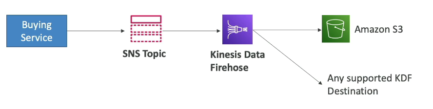

# Amazon SNS

- What if you want to send on message to many receivers?

- The "event producer" only sends messages to one SNS topic
- as many "event receivers" (subscriptions) as we want to listen to the SNS topic notifications
- Each subscriber to the topic will get all the messages (note: new feature to filter messages)
- Up to 12,500,000 subscriptions per topic

- Many services can send data directly to SNS for notifications

## AWS SNS - How to publish

- Topic Publish (using the SDK)

  - Create a topic
  - Create a subscription (or many)
  - Publish to the topic

- Direct Publish (for mobile apps SDK)

  - Create a platform application
  - Create a platform endpoint
  - Publish to the platform endpoint
  - Works with Google GCM, Apple APNS, Amazon ADM

- Encryption

  - In-flight encryption using HTTPS API
  - At-rest encryption using KMS keys
  - Client-side encryption if the client wants to perform encryption/decryption itself

- Access Controls: IAM Policies to regulate access to the SNS API
- SNS Access (similar to S3 buckets policies)
  - Useful for cross-account access to SNS Topics
  - Useful for allowing other services (S3) to write to an SNS topic

## SNS + SQS: Fan Out

- Push once in SNS, receive in all SQS queues that are subscribers

- Fully decoupled, no data loss
- SQS allows for: data persistence, delayed processing and retries of work
- Ability to add more SQS subscribers over time
- Make sure your queue access policy allows for SNS to write
- Cross-Region Delivery: works with SQS Queues in other regions

## Application: S3 Events to multiple queues

- for the same combination of: event type (eg: object create) and prefix you can only have one S3 Event rule
- if you want to send the same S3 event to many SQS queues, use fan-out

- SNS can send to Kinesis and therefore we can have the following solutions architecture:

## Amazon SNS - FIFO Topic

- FIFO = First In First Out (ordering of messages in the topic)
- similar features as SQS FIFO:
  - **Ordering** by message group ID (all messages in the same group are ordered)
  - **Deduplication** using a Deduplication ID or Content Based Deduplication

- Can have SQS Standard and FIFO queues as subscribers
- Limited Throughput (same throughput as SQS FIFO)

## SNS - Message Filtering

- JSON Policy used to filter messages sent to SNS topic's subscriptions
- If a subscription doesn't have a filter policy, it receives every message

