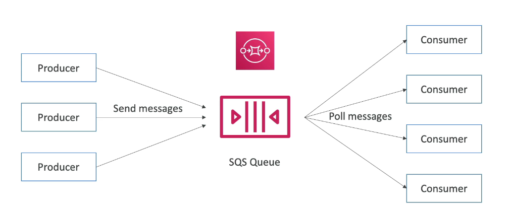
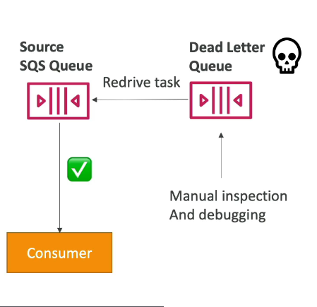
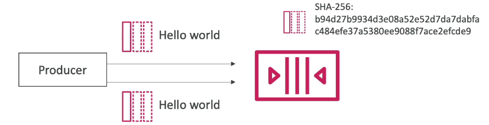

# AWS Integration and Messaging

- Multiple application -> need to communicate with one another
- There are two patters of application communication

1. Synchronous communications (application to application)
2. Asynchronous / Event Based (application to queue tp application)

Synchronous between applications can be problematic if there are sudden spikes of traffic
What if you need to suddenly encode 1000 videos but usually it is 10?

Three models do **decouple** applications:

1. SQS: queue model
2. SNS: pub/sub model
3. Kinesis: real-time streaming model

These services can scale independently from our application

# Amazon SQS

Simple Queue Service

## Amazon SQS - Standard Queue

- Oldest offering (over 10 years old)
- Fully managed service, used to **decouple applications**
- Attributes:

  - unlimited throughput, unlimited number of messages in queue
  - Default retention of messages: 4 days, maximum of 14 days
  - Low latency (<10 mson publish and receive)
  - Limitation of 1MiB per message sent

- Can have duplicate messages (at least once delivery, occasionally)
- Can have out or order messages (best effort ordering)

## SQS - Producing Messages

- Produced to SQS using the SDK (SendMessage API)
- The message is persisted in SQS until a consumer deletes it
- Message retention: default 4 days, up to 14 days

- Example: send an order to be processed

  - Order id
  - Customer id
  - Any attributes you want

- SQS Standard: unlimited throughput

## SQS - Consuming Messages

- Consumers (running on EC2 instances, servers, or AWS Lambda)
- Poll SQS for messages (receive up to 10 messages at a time)
- Process the messages (example: insert the message into an RDS database)

- Consumers receive and process messages in parallel
- at least once delivery
- best-effort message ordering
- consumers delete messages after processing them
- we can scale consumers horizontally to improve throughput of processing

## SQS to decouple between Application Tiers

## Amazon SQS - Security

- Encryption

  - in-flight encryption using HTTPS API
  - At-rest encryption using KMS keys
  - Client-side encryption if the client wants to perform encryption/decryption itself

- Access Controls: IAM policies to regulate access to the SQS API
- SQS Access Policies (similat to S3 bucket policies)
  - useful for cross-account access to SQS queues
  - useful for allowing other services (SNS, S3) to write to an SQS queue

## SQS Queue Access Policy

- Cross Account Access

Attach to the SQS Queue to allow other accounts to poll from SQS queue.

- Publish S3 Events Notifications to SQS Queue

## SQS - Message Visibility Timeout

- After a message is polled by a consumer, it becomes invisible to other consumers
- By default "message visibility timeout" is 30 seconds
- That means the message has 30 seconds to be processed
- After the message visibility timeout is over, the message is "visible" in SQS

- if a message is not processed within the visibility timeout, it will be processed **twice**
- A Consumer could call the **ChangeMessageVisibility** API to get more time
- If visibility timeout is high (hours), and consumer crashes, re-processing will take time
- If visibility timeout is too low (seconds), we may get duplicates

## SQS - Dead Letter Queue (DLQ)

- If a consumer fails to process a message within the VisibilityTimeout...
- the message goes back to the queue!

- We can set a threshold of how many times a message can go back to the queue!
- After the **MaximumReceives** threshold is exceeded, the msesage goes into a dead letter queue (DLQ)

- Useful for debugging

- DLQ of a FIFO queue must also be a FIFO queue
- DLQ of a Standard Queue must also be a Standard queue
- Make sure to process the messages in the DLQ before they expire:
  - good to set a retention period of 14 days in the DLQ

### SQS DLQ - Redrive to Source

- Feature to help consume messages in the DLQ to undestand what is wrong with them
- When our code is fixed, we can redrive the messages from the DLQ back into the source queue (or any other queue) in batches without writing custom code

## Amazon SQS - Delay Queue

- Delay a message (consumers don't see it immediately) up to 15 minutes
- Default is 0 seconds
- Can set a default at queue level
- Can override the default on send using the DelaySeconds parameter

## Amazon SQS - Long Polling

- when a consumer requests messages from the queue, it can optionally "wait" for messages to arrive if there are none in the queue
- this is called Long Polling
- LongPolling decreases the number of API calls made to SQS while increasing the efficiency and decreasing the latency of your application

- the wait time can be between 1 sec to 20 sec (20 sec preferable)
- Long Polling is preferable to Short Polling

- Long Polling can be enabled at the queue level or at the API level using **ReceiveMessageWaitTimeSeconds**

## SQS Extended Client

- Message limit is 1Mib, how to send large messages?
- Using the SQS Extended Client (Java Library)

## SQS - Must know API

- **CreateQueue** (MessageRetentionPeriod), DeleteQueue
- **PurgeQueue**: delete all the messages in queue
- **SendMessage** (DelaySeconds), ReceiveMessage, DeleteMessage
- **MaxNumberOfMessages**: default 1, max 10 (for ReceiveMessage API)
- **ReceiveMessageWaitTimeSeconds**: Long Polling
- **ChangeMessageVisibility**: change the message timeout

- Batch APIs for **SendMessage**, **DeleteMessage**, **ChangeMessageVisibility** helps decrease your costs

## Amazon SQS - FIFO Queue

- FIFO = First In First Out (orderin of messages in the queue)
- Limited throughput: 300 msg/s without batching, 3000 msg/s with
- Exactly-once send capability (by removing duplicates using Deduplication ID)
- Messages are processed in order by the consumer
- Ordering by Message Group ID (all messages in the same group are ordered) - mandatory parameter

### SQS FIFO - Deduplication

- De-duplication is 5 minutes
- Two de-duplication methods:
  - Content-based deduplication: will do a SHA-256 hash of the message body
  - Explicity provide a Message Deduplication Id

### SQS FIFO - Message Grouping

- If you specify the same value of **MessageGroupID** in an SQS FIFO queue, you can only have on consumer, and all the messages are in order
- To get ordering at the level of a subset of messages, specify different values for **MessageGroupID**
  - Messages that share a common Message Group ID will be in order within the group
  - Each Group ID can have a different consumer (parallel processing)
  - Ordering across groups is not guaranteed

