# AWS CloudWatch

- Metrics: Collect and track key metrics
- Logs: Collect, monitor, analyze and store log files
- Events: Send Notifications when certain events happen in AWS
- Alarms: React in Real-time to metrics / events

# AWS X-Ray

- Troubleshooting application performance and errors
- Distributed tracing of microservices

# AWS CloudTrail

- Internal monitoring of API calls being made
- audit changes to AWS Resources by your users

# AWS CloudWatch

## AWS CloudWatch Metrics

- CloudWatch provides metrics for every services in AWS
- **Metric** is a variable to monitor (CPUUtilization, NetworkIn, ...)
- Metrics belong to **namespaces**
- **Dimension** is an attribute of a metric (instance id, environment etc)
- Up to 30 dimensions per metric
- Metrics have **timestamps**
- Can create CloudWatch dashboards of metrics

## EC2 Detailed Monitoring

- ECS instance metrics have metrics "every 5 minutes"
- With detailed monitoring (for a cost), you get data "every 1 minute"
- Use detailed monitoring if you want to scale faster for your ASG
- The AWS Free Tier allows us to have 10 detailed monitoring metrics
- Note: EC2 Memory usage is by default not pushed (must be pushed from inside the instance as a custom metric)

## CloudWatch Custom Metrics

- possibility to define and send your own custom metrics to CloudWatch
- Example: memory (RAM) usage, disk space, number of logged in users...
- Use API call PutMetricData
- Ability to use dimensions (attributes) to segment metrics
  - Instance.id
  - Environment.name
- Metric resolution (StorageResolution API parameter - two possible value):
  - Standard: 1 minute (60 seconds)
  - High Resolution: 1/5/10/30 seconds - Higher Cost
- Important: accept metric data points two weeks in the past and two hours in the future (make sure to configure your EC2 instance time correctly)

## CloudWatch Logs

- Log Groups: arbitrary name, usually representing an application
- Log Stream: instances within application / log files / containers
- Can define log expiration policies (never expire, 1 day to 10 years)
- CloudWatch Logs can send logs to:
  - Amazon S3 (exports)
  - Kinesis Data Streams
  - Kinesis Data Firehose
  - AWS Lambda
  - OpenSearch
- Logs are encrypted by default
- Can setup KMS-based encryption with your own keys

### Sources

- SDK, CloudWatchLogs Agent, CloudWatch Unified Agent
- Elastic Beanstalk: collection of logs from application
- ECS: collection from containers
- AWS Lambda: collection from funcion logs
- VPC Flow Logs: VPC specific logs
- API Gateway
- CloudTrail based on filter
- Route53: all DNS queries

### CloudWatch Logs Insights

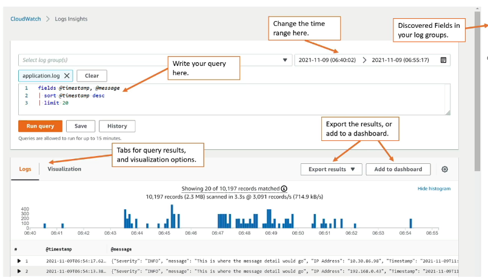

- Search and analyze log data stored in CloudWatch Logs
- Example: find a specific IP inside a log, count occurences of "ERROR" in your logs
- Provides a purpose-built query language
  - automatically discovers fields from AWS services and JSON log events
  - fetch desired event fields, filter based on conditions, calculate aggregate statistics, sort events, limit number of events
  - can save queries and add them to CloudWatch Dashboards
- Can query multiple Log Groups in different AWS accounts
- It's a query engine, not a real-time engine

### CloudWatch Logs Subscription

- Get a real-time log events from CloudWatch Logs for processing and analysis
- send to Kinesis Data Streams, Kinesis Data Firehose, or Lambda
- **Subscription Filter** - filter which logs are events delivered to your description

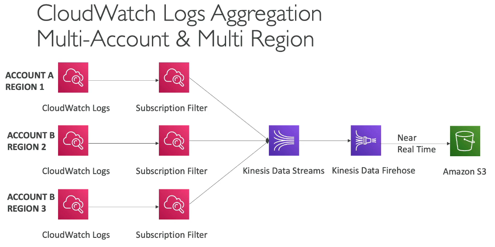

- Cross-Account Subscription - send log events to resources in a different AWS account (KDS, KDF)

### CloudWatch Logs for EC2

- By default, no logs from your EC2 machine will go to CloudWatch
- You need to run a CloudWatch agent on EC2 to push the log files you want
- make sure IAM permissions are correct
- The CloudWatch log agent can be setup on-premises too

#### CloudWatch Logs Agent & Unified Agend

- For virtual servers (EC2 instances, on-premise servers)
- **CloudWatch Logs Agent**

  - old version of the agent
  - can only send to CloudWatch Logs

- **CloudWatch Unified Agent**

  - Collect Additional system-level metrics such as RAM, processes, etc
  - Collect logs to send to CloudWatch Logs
  - Centralized configuration using SSM Parameter Store
  - Metrics:
    - CPU (active, guest, idle, system, user, steal)
    - Disk metrics
    - RAM
    - Netstat
    - Processes
    - Swap Space
  - Reminder: out-of-the box metrics for EC2 (higher level)

### CloudWatch Logs Metric Filter

- CloudWatch Logs can use filter expression
  - for example, find a specific IP inside of a log
  - or count occurrences of "ERROR" in your logs
  - Metric filters can be used to trigger alarms
- Filter do not retroactively filter data. Filter only publish the metric data points for events that happen after the filter was created.
- Ability to specify up to 3 dimensions for the Metric Filter

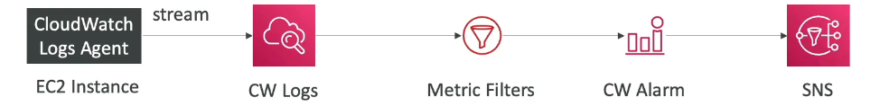

## CloudWatch Alarms

- Alarms are used to trigger notifications for any metric
- Various options (sampling, %, max, min, etc)
- Alarm States:
  - OK
  - INSUFFICIENT_DATA
  - ALARM
- Period:
  - length of time in seconds to evaluate the metric
  - high resolution custom metrics: 10 sec, 30 sec or multiple of 60 sec

### Targets

- Stop, Terminate, Reboot or Recover and EC2 Instance
- Trigger Auto Scaling Action
- Send Notification to SNS (from which you can do pretty much anything)

### Composite Alarms

- CloudWatch Alarms are on a single metric
- Composite Alarms are monitoring the states of multiple other alarms
- AND and OR conditions
- Helpful do reduce "alarm noise" by creating complex composite alarms

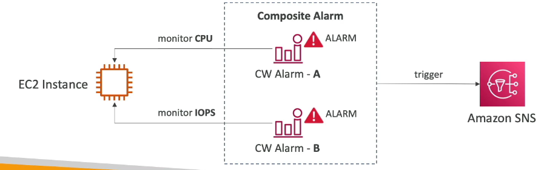

### EC2 Instance Recovery

- Status Check

  - Instance Status = check the EC2 VM
  - System Status = check the underlying hardware
  - Attached EBS Status = check attached EBS volumes

- Recovery: Same Private, Public and Elastic IP, metadata, placement group

### Good to know

- Alarms can be created based on CloudWatch Logs Metrics Filter
- To test Alarms and notifications, set the alarm state to Alarm using CLI

### CloudWatch Synthetics Canary

- Configurable script that monitor your APIs, URLs, Websites,
- Reproduce what your customers do programatically to find issues before customers are impacted
- Checks the availability and latency of your endpoints and can store load time data and screenshots of the UI
- Integration with CloudWatch Alarms
- Nodejs or Python
- Programmatic access to a headless Google Chrome browser
- Can run once or on a regular schedule

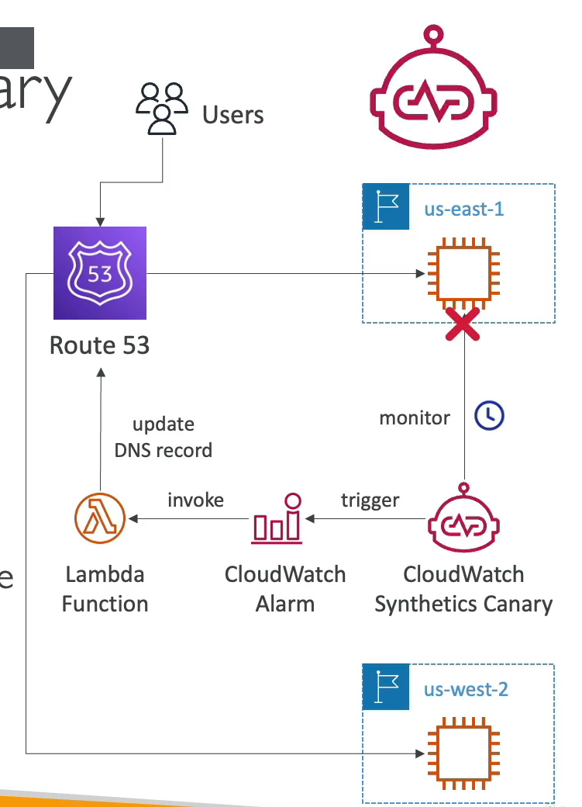

## Amazon EventBridge

- Schedule: Cron Jobs (schedule scripts)
  - every hour ... -> trigger script on Lambda Function
- Event Pattern: Event rules to react to a service doing something
- Trigger Lambda functions, send SQS, SNS messages

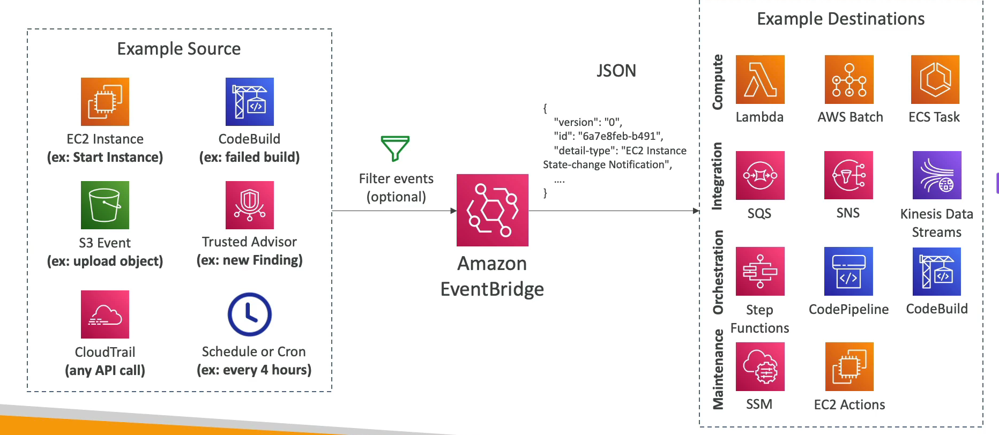

- Event buses can be accessed by other AWS accounts using Resource-based Policies
- You can archive events (all/filter) sent to an event bus (indefinitely or set period)
- Ability to replay archived events

### Schema Registry

- Event bridge can analyze the events in your bus and infer the **schema**
- The schema registry allows you to generate code for your application, that will know in advance how data is structured in the event bus
- Schema can be versioned

### Resource-based Policy

- Manage permissions for a specific Event Bus
- Example: allow/deny events from another AWS account or AWS region
- Use case aggregate all events from your AWS Organization in a single AWS account or AWS Region

## AWS X-Ray

- Debugging in Production, the good old way:
  - test locally
  - add log statements everywhere
  - Re-deploy in production
- Log formats differ across applications using CloudWatch and analytics is hard
- Debugging: monolith is "easy", distributed services are "hard"
- No common views of your entire architecture

- Enter AWS X-ray
- visual analysis of our applications
- tracing

### Advantages

- Troubleshooting performance (bottlenecks)
- Understand dependencies in a microservice architecture
- Pinpoint service issues
- Review request Behavior
- Find errors and exceptions
- Are we meeting time SLA?
- Where I am throttled?
- Identify which users are impacted

### Compatibility

- AWS Lambda
- Elastic Beanstalk
- ECS
- ELB
- API Gateway
- EC2 Instances or any application server (even on premise)

### AWS X-Ray Leverages Tracing

- Tracing is an end to end way to following a "request"
- Each component dealing with the request adds it own "trace"
- Tracing is made of segments (+ sub segments)
- Annotations can be added to traces to provide extra-information
- Ability to trace:
  - every request
  - sample request (as a % for example or a rate per minute)
- X-Ray security
  - IAM for authorization
  - KMS for encryption at rest

### Enabling AWS X-ray

- Enable it at the code (must import the AWS X-Ray SDK)
- Install the X-Ray daemon or enable X-Ray AWS Integration

  - X-Ray daemon works as a low level UDP Packet interceptor
  - AWS Lambda / other AWS services already run the X-Ray daemon for you
  - Each application must have the IAM rights to write data to X-Ray
    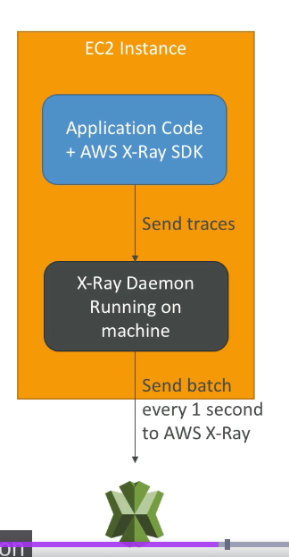

- If X-Ray is not working on EC2

  - Ensure the EC2 IAM Role has the proper permissions
  - Encure the EC2 instance is running the X-Ray Daemon

- To enable on AWS Lambda
  - Ensure it has IAM execution role with proper policy (AWSX-RayWriteOnlyAccess)
  - Ensure that X-Ray is imported in the code
  - Enable Lambda **X-Ray Active Tracing**

### AWS X-Ray Instrumentation

- Instrumentation means the measure of product's performance, diagnose errors, and to write trace information
- To instrument your application code, you use the X-Ray SDK
- Many SDK require only configuration changes
- You can modify your application code to customize and annotation the data that the SDK sends to X-Ray, using interceptors, filters, handlers, middleware ...

### X-Ray concepts

- Segments: each application / service will send them
- Subsegments: if you need mode details in your segment
- Trace: segments collected together to form and end-to-end trace
- Sampling: decrease the amount of requests sent to X-Ray, reduce cost
- Annotations: Key value pairs used to index traces and use with filters
- Metadata: Key Value pairs, not indexed, not used for searching

- The X-Ray daemon, agent has a config to send traces cross account:
  - make sure the IAM permissions are correct - the agent will assume the role
  - This allows to have a central account for all your application tracing

### X-Ray Sampling Rules

- with sampling rules, you control the amount of data that you record
- you can modify sampling rules without changing your code

- By default, X-Ray SDK records the first request each second, and five percent of any additional requests
- One request per second is the **reservoir**, which ensures that at least one trace is recorded each second as long as the service is serving requests
- Five percent is the **rate** at which additional requests beyond the reservoir size are sampled

- you can create your own rules with the reservoir and rate

### X-Ray Write APIs (used by the X-Ray daemon)

- PutTraceSegments: Uploads segment documents to AWS X-Ray
- PutTelemetryRecords
- GetSamplingRules
- GetSamplingTargets & GetSamplingStatisticSummaries: advanced
- The X-Ray daemon needs to have an IAM policy authorizing the correct API calls to function correctly

### X-Ray Read APIs

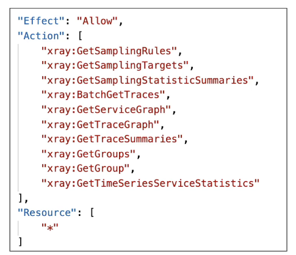

## AWS Distro for OpenTelemetry

- Secure, production ready AWS-supported distribution of the open-source project OpenTelemetry project
- Provides a single set of APIs, libraries, agents, and collector services
- Collects distributed traces and metrics from your apps
- Collects metadata from your AWS resources and services
- **Auto-instrumentation Agents** to collect traces without changing your code
- Send traces and metrics to multiple AWS services and partner solutions
  - X-Ray, CloudWatch, Prometheus
- Instrument your apps running on AWS (EC2, ECS, EKS, Fargate, Lambda) as well as on-premises
- Migrate from X-ray if you want to standardize with open-source APIs from Telemetry or send traces to multiple destinations simultaneously

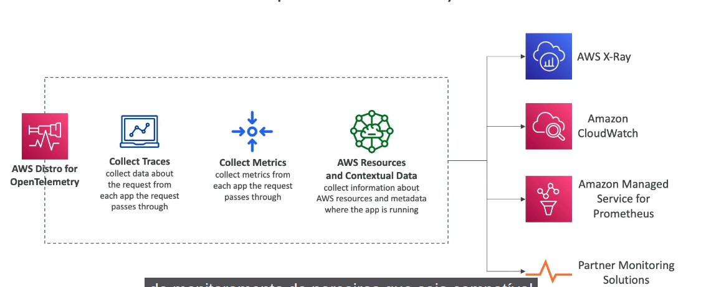

## AWS CloudTrail

- Provides governance, compliance and audit for your AWS account
- CloudTrail is enabled by default
- Get an history of events / API calls made with your AWS account by:
  - console
  - SDK
  - CLI
  - AWS Services
- Can put logs from CloudTrail into CloudWatch Logs or S3
- A trail can be applied to All Regions (default) or a single Region
- If a resource is deleted in AWS, investigate CloudTrail first

### CloudTrail Events

- Management Events

  - Operations that are performed on resources in your AWS account
  - Examples:
    - configuring security (IAM AttachRolePolicy)
    - configuring rules for routing data
    - Setting up logging (AWS CloudTrail CreateTrail)
  - By default, trails are configured to log management events
  - can separate Read Events from Write Events

- Data Events

  - By default, datava events are not logged (because high volume operations)
  - Amazon S3 object-level activity: can separate read and write events
  - AWS Lambda Functions execution activity (Invoke API)

- CloudTrail Insight Events

### CloudTrail Insights

- Enable CloudTrail Insights to detect unusual activity in your account
  - innacurate resource provisioning
  - hitting service limits
  - Burts of AWS IAM actions
  - Gaps in periodic maintenance activity
- CloudTrail Insights analyzes normal management events to create a baseline
- And then continuouly analyzes write events to detect unusual patterns
  - anomalies appear in theCloudTrail console
  - Event is sent to Amazon S3
  - An EventBridge event is generated - for automation needs

### CloudTrail Events Retention

- Events are stored for 90 days in CloudTrail
- To keep events beyond this period, log them to S3 and use Athena

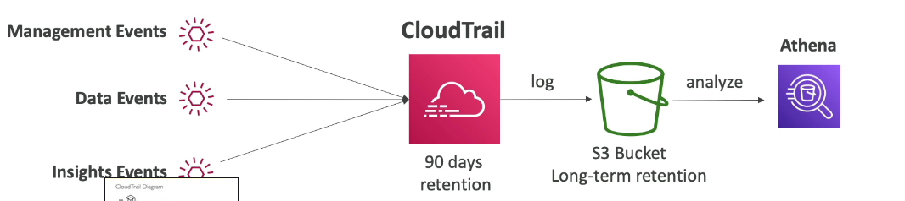

### Amazon EventBridge - Intecercept API Calls

For example, DeleteTable on DynamoDB

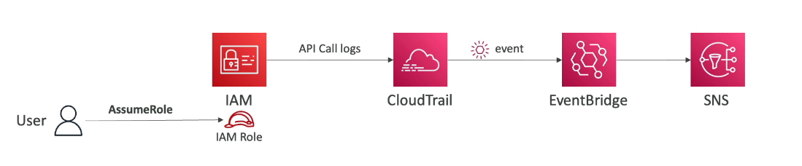
